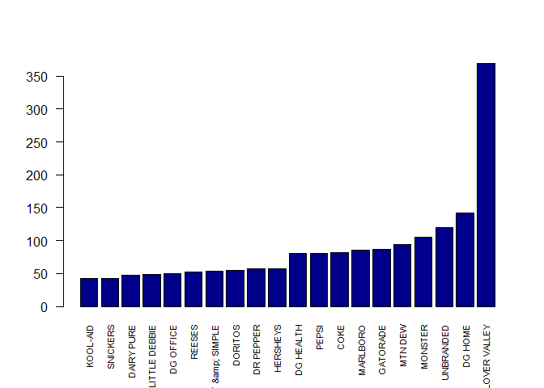

# Association Rules Mining for RB Data
Dennis Murray and Alex Deshowitz <br> Southern Methodist University- MSDS 7331 <br> April 23, 2017  
#**Introduction**

  This project seeks to use a dataset from a major retailer to create association rules for our product, RB.  Creating these associations may better help us determine whether or not to use partnerships or reward programs with our customers.  It may also help us develop customer segmentation models based upon variables such as items purchased, brands in the customer basket, and size of overall order.  Ultimately, knowing these pieces of information about our customers will help us better monetize our product, build brand-awareness, and increase brand acquisition for customers who may not have considered our product otherwise.

#**Business Understanding**

  This dataset was collected as part of normal operations at a major retailer.  The purpose of the collection of this information was multiple-fold.  First, this data was collected to track inventories in the store and manage supply chain interactions.  Additionally, this data was collected so that companies selling the products on the shelf in the retailer could gain better insight into product movements and shifts.  Since this data is already being collected, we can now use this information to create association rules that will allow us to better understand the customers who purchase RB.  By understanding this customer better, we will be able to translate that knowledge into better products for the customer, better placement, enhanced partnerships, and increased gross sales.

ADDRESS VALIDATION METHODS

# **Data Understanding**

###Overview

Our dataset was collected by a major retailer and as RB we are using this data for our analysis.  The dataset consists of 5 attributes.  The total size of our dataset is 10,263,051 records.  However, we do do some filtering in the EDA section of the framework in order to better focus on the objective of the analysis.

### Data Dictionary

**TransactionID**: The transaction ID represents each unique transaction.  There is one record for every item in                         each transaction.  This is aggregated by the item (i.e- a transaction with 2 cans of Red Bull                         will have 1 record for redbull)

**ClassDesc**: Description of the product's class.  This is a high level category the product bought falls into.
  
**DeptDesc**: This is a subset of class. 
  
**Brand**: Product's brand name as created in the item master.
  
**Units**: Units sold in the current transaction.

### Load All Packages

```r
packages<- c('plyr','data.table','dplyr','arules','arulesViz','tidyr','ggplot2','magrittr', 'sqldf')

sapply(packages, library, character.only = TRUE)
```

### Load Main dataframe

```r
BasketData<-read.csv("Data/BasketData.csv")
colnames(BasketData)<-c("TransactionID", "ClassDesc", "DeptDesc", "Brand", "Units")
BasketData$Units<-as.numeric(gsub(",", "", as.character(BasketData$Units)))
```

### **EDA- Initial Integrity Checks**

We always take a series of steps to ensure that our dataset is clean and does not contain errors prior to our initial data exploration.  What follows is that process:


```r
summary(BasketData)
```

```
##  TransactionID                            ClassDesc      
##  Min.   :-1.128e+09   CARBONATED DRINK-DROPSHIP: 565332  
##  1st Qu.:-1.118e+09   SALTY SNACKS-DROPSHIP    : 324499  
##  Median :-1.109e+09   CHOCOLATE CANDY          : 246999  
##  Mean   :-1.108e+09   NON-CHOCOLATE CANDY      : 180172  
##  3rd Qu.:-1.098e+09   SINGLE SERVE             : 165817  
##  Max.   :-1.074e+09   SALTY SNACKS             : 161092  
##                       (Other)                  :8619140  
##            DeptDesc                      Brand             Units         
##  CANDY & SNACKS:2820622   CLOVER VALLEY     : 708658   Min.   : -48.000  
##  FOOD          :1194796                     : 462120   1st Qu.:   1.000  
##  HOME CLEANING : 933022   DG HOME           : 423373   Median :   1.000  
##  HEALTH CARE   : 792473   UNBRANDED         : 262543   Mean   :   1.341  
##  BEAUTY CARE   : 771913   DG HEALTH         : 253359   3rd Qu.:   1.000  
##  PAPER PRODUCTS: 730928   SMART &amp; SIMPLE: 157127   Max.   :1800.000  
##  (Other)       :3019297   (Other)           :7995871
```
We notice that the dataset appears to contain negative units.  After some exploration of the data, it was determined that these values should be filtered out.  However, remember, that this is transaction data.  Therefore, we don't want to take only the negative values from the transaction.  Our assumption is that one of these values showing up in a transaction negates the entire transaction.  Therefore, some more complex filtering is necessary. We will do the filtering at the end of this process.


```r
str(BasketData)
```

```
## 'data.frame':	10263051 obs. of  5 variables:
##  $ TransactionID: int  -1121778503 -1121778503 -1121778503 -1121778503 -1121778719 -1121778719 -1127563380 -1127563380 -1127563306 -1127563306 ...
##  $ ClassDesc    : Factor w/ 747 levels "$1 TOYS","ACNE TREATMENT",..: 646 522 116 533 651 125 1 635 651 673 ...
##  $ DeptDesc     : Factor w/ 25 levels "ACCESSORIES",..: 2 3 3 3 3 23 24 3 3 7 ...
##  $ Brand        : Factor w/ 1963 levels "","1893","3 MUSKETEERS",..: 510 1714 826 877 1131 1076 899 396 826 724 ...
##  $ Units        : num  1 2 2 1 1 1 2 1 3 1 ...
```
It looks like all of the variables were read in correctly based on the datatypes. There are 1963 unique brands in the dataset, 25 different departments, and 747 different classes of those items.

Let's take a deeper look into the brands present in the dataset.


```r
dt <- data.table(BasketData)
dt <- dt[,sum(Units),by = Brand]
dt <- dt[order(V1)]

par(mfrow = c(1,1))

barplot(tail(dt$V1,20), names.arg = tail(dt$Brand,20), cex.names = 0.7, las = 2, col = 'dark blue', ylab = 'Total Units', main = 'Top-20 Brands' )
```

<!-- -->

```r
barplot(head(dt$V1,20), names.arg = head(dt$Brand,20), cex.names = 0.7, las = 2, col = 'dark blue', ylab = 'Total Units', main = 'Bottom-20 Brands' )
```

<!-- -->

```r
par(mfrow = c(1,1))
```

It looks like we have some brands that are not labeled.  We will want to filter these out of our main dataset before we do any modeling as this will not provide us further insight down the road

Let's look at the blanks to make sure.


```r
df_analysis<- BasketData[BasketData$Brand == "",]

dfa_dt <- data.table(df_analysis)
dfa_dt <- dfa_dt[,sum(Units),by = DeptDesc]
dfa_dt <- dfa_dt[order(-V1),]

barplot(head(dfa_dt$V1,20),names.arg = head(dfa_dt$DeptDesc, 20), cex.names = 0.7, las = 2, col = 'dark blue', main = 'Most frequent items with no brand')
```

<!-- -->

It looks like stationary is the most "keyed-in" item in the dataset.  There are about 100,000 records for candy and snacks that were keyed in.  While this is not ideal, to filter out candy and snack records, not having this information just introduces incomplete data.  This solidifies the fact that we should probably remove these items. We also have the luxury of having a large number of observations to build our model on.  Therefore the filtering of a couple hundred thousand records is not the end of the world.


### **EDA- Tidy data filtering**

Now that we know that we want to filter out the records with no brand and the records with negative values for individual scans within the transaction, we have to do some interesting filtering.

In order to maintain the integrity of our model, we have to come up with a way to filter the data that allows us to 1.) identify  the transactions that contain negative values 2.) filter out those entire transactions.  

Given that we have such a large dataset, we can afford to filter out entire transactions that contain partial bad records.  While some of these transactions do more than likely contain valid transaction-portions, we cannot be certain.  Therefore, the more conservative approach when thinking about association rule creation is to not risk leaving in partial records that could represent bad data.  We will use the SQLdf package for this portion of the analysis.


```r
# let's take out the transactions that contain negative values
# notice that we are taking out distinct transactions and not just those items. 
# this ensures that we get whole itemsets that are not incomplete
BasketData<- sqldf('Select TransactionID, ClassDesc, DeptDesc, Brand, Units
                   From BasketData Where TransactionID Not In  
                   (Select Distinct
                   TransactionID
                   From BasketData
                   Where 
                   Units<=0)')
```

```
## Loading required package: tcltk
```

```
## Warning: Quoted identifiers should have class SQL, use DBI::SQL() if the
## caller performs the quoting.
```

```r
# ok, that looks like it worked.  Now, we need to see what removal of the transactions without any brand looks like

BasketData<- sqldf('Select TransactionID, ClassDesc, DeptDesc, Brand, Units
                   From BasketData Where TransactionID Not In  
                   (Select Distinct
                   TransactionID
                   From BasketData
                   Where 
                   Brand="")')
```


### **EDA- Learning the Data**

How many transactions contain Redbull?


```r
df_analysis_redbull<- BasketData[BasketData$Brand == "RED BULL",]

length(unique(df_analysis_redbull$TransactionID)) # 14046 transactions have redbull
```

```
## [1] 14046
```

```r
length(unique(BasketData$TransactionID))# 2493458
```

```
## [1] 2493458
```
What percentage of transactions is this?


```r
length(unique(df_analysis_redbull$TransactionID))/
  length(unique(BasketData$TransactionID)) # looks like about 0.56% of all transactions have a redbull
```

```
## [1] 0.005633141
```

What Class is Red Bull?


```r
unique(df_analysis_redbull$ClassDesc)
```

```
## [1] NON-CARBONATED DROPSHIP
## 747 Levels: $1 TOYS ACNE TREATMENT ADHESIVES ... YOUTH SS GIRL
```

It is really interesting that RedBull is in the non-carbonated class

How many redbulls does the average transaction contain?


```r
mean(df_analysis_redbull$Units)
```

```
## [1] 1.32422
```

```r
max(df_analysis_redbull$Units)
```

```
## [1] 14
```

```r
min(df_analysis_redbull$Units)
```

```
## [1] 1
```
Looks like about 1.3 units and somebody purchased about 14 units.

What does the distribution of purchased look like? It is probably highly skewed to 1-item purchases.


```r
qplot(Units, data = df_analysis_redbull, geom = 'histogram')
```

```
## `stat_bin()` using `bins = 30`. Pick better value with `binwidth`.
```

<!-- -->

Just as we thought based on the analysis, mostly one and two can purchases

What is RedBull's candy & snacks transaction share?


```r
print('Number of candy and snack transactions:' )
```

```
## [1] "Number of candy and snack transactions:"
```

```r
length(unique(BasketData$TransactionID[BasketData$DeptDesc=='CANDY & SNACKS'])) # 1,217,781 with candy or snacks
```

```
## [1] 1217781
```

```r
print('Number of total transactions:' )
```

```
## [1] "Number of total transactions:"
```

```r
length(unique(BasketData$TransactionID)) #2,493,458 total transactions
```

```
## [1] 2493458
```

```r
print('Percent of transactions with candy and snacks: ')
```

```
## [1] "Percent of transactions with candy and snacks: "
```

```r
length(unique(BasketData$TransactionID[BasketData$DeptDesc=='CANDY & SNACKS']))/length(unique(BasketData$TransactionID))
```

```
## [1] 0.4883904
```

```r
print('Percent of candy and snack transactions with RedBull: ')
```

```
## [1] "Percent of candy and snack transactions with RedBull: "
```

```r
length(unique(df_analysis_redbull$TransactionID))/length(unique(BasketData$TransactionID[BasketData$DeptDesc=='CANDY & SNACKS']))
```

```
## [1] 0.01153409
```

```r
# 1.1% of candy or snack transactions contain redbull
```

Alright, it looks like nearly 50% of the transactions in our dataset are in the candy and snacks department, which is the same department as redbull.  

1.1% of all candy and snack transactions contain redbull

I wonder what the biggest competitor looks lik?


```r
df_analysis_monster<- BasketData[BasketData$Brand == "MONSTER",]

length(unique(df_analysis_monster$TransactionID)) # 25,338 transactions have Monster
```

```
## [1] 25338
```

About 25,338 transactions contain Monster; however, the do alot of 2-4-1 offers, so we need to account for that when thinking about things like transaction size.


```r
print('mean:')
```

```
## [1] "mean:"
```

```r
mean(df_analysis_monster$Units)
```

```
## [1] 1.509275
```

```r
print('max:')
```

```
## [1] "max:"
```

```r
max(df_analysis_monster$Units)
```

```
## [1] 47
```

```r
print('min:')
```

```
## [1] "min:"
```

```r
min(df_analysis_monster$Units)
```

```
## [1] 1
```

```r
print('percentage higher than redbull:' )
```

```
## [1] "percentage higher than redbull:"
```

```r
mean(df_analysis_monster$Units)/mean(df_analysis_redbull$Units)-1
```

```
## [1] 0.1397458
```
Just as suspected, the average transaction amount is a tad higher.  We may want to look at the transaction distribution, despite the fact that it will have a very high positive skew due to all of the 1-item transactions.


```r
par(mfrow = c(1,2))

# create the dataframe
rb <- data.frame(rep('RedBull', length(unique(df_analysis_redbull$TransactionID))))
df1<- cbind(rb, data.frame(df_analysis_redbull$Units))
colnames(df1) = c('brand','units')

mon <- data.frame(rep('Monster', length(unique(df_analysis_monster$TransactionID))))
df2<- cbind(mon, data.frame(df_analysis_monster$Units))
colnames(df2) = c('brand','units')


df3<- rbind(df1,df2)

boxplot(units~brand, data = df3)

# looks like 42 from Monster skews things a bit, let's filter it

df3<- df3[df3$units<30,]

boxplot(units~brand, data = df3)
```

<!-- -->

```r
par(mfrow = c(1,1))
```
Ok, it doesnt look like their distributions are really that much different.  Both have a high degree of positive skew.

We would like to look at Redbull on a transaction level next.  This will help us better understand the rules that we get out of our model.

How many items are purchased in each Redbull transaction?


```r
# How many items are purchased in each redbull transaction?

redbull_items_purchased<-sqldf('select avg(brands) As num_brands, avg(total_units) As avg_units From
                               (select TransactionID,count(Distinct(Brand)) As brands,
                               Sum(Units) AS total_units  From BasketData Where 
                               TransactionID in (select distinct TransactionID From BasketData Where Brand = "RED BULL") Group By 1)' )

print(redbull_items_purchased)
```

```
##   num_brands avg_units
## 1   3.869287  5.257867
```
On average, there are about 5.3 units in each transaction.  We also see that there are fewer brands.  Therefore, this means that something is getting purchased multiple times in the transaction. Let's hope it is RB.

Are most transactions Redbull by itself?


```r
redbull_plus_snack_df<-sqldf('select TransactionID, ClassDesc, DeptDesc, Brand, Units  From BasketData Where 
                             TransactionID in (select distinct TransactionID From BasketData Where Brand = "RED BULL")
                             And Brand<> "RED BULL"')

length(unique(redbull_plus_snack_df$TransactionID)) 
```

```
## [1] 11375
```
Alright, the vast majority of Redbull transactions contain alot more than one item.

Ok, which brands are most often purchased with RB?


```r
brand_df<- sqldf('Select Brand, Count(*) As trans, Sum(Units) As units_purch  From redbull_plus_snack_df Group By 1 Order By 3')


barplot(tail(brand_df$units_purch,20), names.arg = tail(brand_df$Brand,20), cex.names = 0.7, las = 2, col = 'dark blue' )
```

<!-- -->

It looks like we have some store brands, and unbranded category (SHOULD WE FILTER OUT?).  Wow!  Monster is the next most purchased, followed by Mountain Dew. It is really interesting.  Lots of energy products are purchased together and junk food also appears to be very popular.

That's nice, but which department are these items in?


```r
department_df<- sqldf('Select DeptDesc, Count(*) As trans, Sum(Units) As units_purch  From redbull_plus_snack_df Group By 1 Order By 3')

barplot(tail(department_df$units_purch,20), names.arg = tail(department_df$DeptDesc,20), cex.names = 0.7, las = 2, col = 'dark blue' )
```

<!-- -->
Just as we saw earlier, candy and snacks dominate.


Which classes do these encompass?


```r
class_df<- sqldf('Select ClassDesc, Count(*) As trans, Sum(Units) As units_purch  From redbull_plus_snack_df Group By 1 Order By 3')

barplot(tail(class_df$units_purch,20), names.arg = tail(class_df$ClassDesc,20), cex.names = 0.7, las = 2 , col ='dark blue')
```

<!-- -->

So the non-carbonated looks high.  However, now we see that cigarettes are pretty popular compliments to the Redbull


I wonder which candy and snacks are most popular with RedBull?


```r
candy_snack_df<- sqldf('Select Brand, Count(*) As trans, Sum(Units) As units_purch  
                       From redbull_plus_snack_df Where DeptDesc ="CANDY & SNACKS" Group By 1 Order By 3')

barplot(tail(candy_snack_df$units_purch,20), names.arg = tail(candy_snack_df$Brand,20), cex.names = 0.7, las = 2 , col = 'dark blue')
```

<!-- -->
All soft drinks and doritos. We can see that it might be appealing to have a little sweet and savory.  However, it looks like sweets are also a favorite, with little debbies and Hersheys being up next.


Something we have to jump into now is the idea of different combinations of transactions.  We should probably group the dataset by the number of items in each transaction.  This will help us better interpret the rules that we get out of the model as interesting or not.  It also may help us set our values for minsup, etc.


```r
# add dimension to the dataset

redbull_brands_in_trans<-sqldf('select T1.TransactionID As TransactionID ,brands, ClassDesc, DeptDesc, Brand, Units  
                               From BasketData As T1
                               Inner Join ( Select TransactionID, Count(Distinct(Brand)) As brands From BasketData Group By 1) As T2
                               On T1.TransactionID = T2.TransactionID
                               Where T1.TransactionID in (select distinct TransactionID From BasketData Where Brand = "RED BULL")')
```

**Transactions with 2 brands**


```r
# 2 brand transactions (filter out RB)

two_brand_trans<- sqldf('select brand, sum(Units) As units From redbull_brands_in_trans
                        Where
                        Brand <> "RED BULL"
                        And brands = 2
                        Group By 1
                        Order By 2
                        
                        ')

barplot(tail(two_brand_trans$units,20), names.arg = tail(two_brand_trans$Brand,20), cex.names = 0.7, las = 2, col = 'dark blue' )
```

<!-- -->
So, a few things start to shake out here.  We see that in 2 brand transactions Marlboros are very popular.  This is of course followed by Monster.  

**Transactions with 3 brands**


```r
# 3 brand transactions (filter out RB)

three_brand_trans<- sqldf('select brand, sum(Units) As units From redbull_brands_in_trans
                          Where
                          Brand <> "RED BULL"
                          And brands = 3
                          Group By 1
                          Order By 2
                          
                          ')

barplot(tail(three_brand_trans$units,20), names.arg = tail(three_brand_trans$Brand,20), cex.names = 0.7, las = 2, col ='dark blue'
        )
```

<!-- -->
As we start adding more items, store brands start to become a larger proportion.  This is probably a customer who comes in for one thing and picks up some smokes and an energy boost while they are at it.


**Transactions with 4 brands**


```r
four_brand_trans<- sqldf('select brand, sum(Units) As units From redbull_brands_in_trans
                         Where
                         Brand <> "RED BULL"
                         And brands = 4
                         Group By 1
                         Order By 2
                         
                         ')

barplot(tail(four_brand_trans$units,20), names.arg = tail(four_brand_trans$Brand,20), cex.names = 0.7, las = 2, col = 'dark blue' )
```

<!-- -->
So, it looks like folks who come in for more than 3 distinct items still like to purchase other energy drinks, but cigarettes occur in fewer transactions.  Store brands also become much more popular.

**Transactions with 5 brands**


```r
five_brand_trans<- sqldf('select brand, sum(Units) As units From redbull_brands_in_trans
                         Where
                         Brand <> "RED BULL"
                         And brands = 5
                         Group By 1
                         Order By 2
                         
                         ')

barplot(tail(five_brand_trans$units,20), names.arg = tail(five_brand_trans$Brand,20), cex.names = 0.7, las = 2, col= 'dark blue' )
```

<!-- -->

It looks like home products really jump up with 5 items.  We definitely see alot of consistency in the top 10 brands that are all purchased together though.

That being said, we would like a better way of associating these products together than simple visual analytics.  It would be really nice to be able to look at significant rules and baskets that occur very frequently as it is obviously very cumbersome to do with nearly 2000 brands.

### **Association Rules**

####**Overview**

For the first sets of rules, we will really trim down the dataset substantially. We will only look at transactions that contained redbull as we are most interested in the rules associated with those transactions.  We will then show transactional rules for product classes and all products in the entire dataset.  By creating rules for the entire set, we can see if there are any interesting baskets of data that Redbull should want to be a part of in the future.

####Redbull Transactions- Brand Level Rules

We will use a filtered dataframe to produce rules around just the purchases that include RedBull


```r
redbull_arules<-sqldf('select TransactionID, ClassDesc, DeptDesc, Brand, Units  From BasketData Where 
                             TransactionID in (select distinct TransactionID From BasketData Where Brand = "RED BULL")
                             ')
```


```r
head(redbull_arules)
```

```
##   TransactionID               ClassDesc       DeptDesc          Brand
## 1   -1121778412 NON-CARBONATED DROPSHIP CANDY & SNACKS         LIPTON
## 2   -1121778412 NON-CARBONATED DROPSHIP CANDY & SNACKS       RED BULL
## 3   -1121778412                   JUICE           FOOD  SUNNY DELIGHT
## 4   -1121778412              CIGARETTES        TOBACCO       MARLBORO
## 5   -1127563344        DAIRY-FLUID MILK    PERISHABLES     DAIRY PURE
## 6   -1127563344                   JUICE           FOOD HAWAIIAN PUNCH
##   Units
## 1     1
## 2     2
## 3     1
## 4     2
## 5     1
## 6     1
```

This is nice, but I am going to need to pair this particular dataset down a bit.  It might make sense to look at just the baskets for the departments that are most common in RedBull transactions.  Let's see what those are


```r
most_common_depts = sqldf('select deptdesc, count(*) As occurances From redbull_arules Where Brand <> "RED BULL" Group By 1 Order By 2 desc')
```


```r
head(most_common_depts)
```

```
##         DeptDesc occurances
## 1 CANDY & SNACKS      15757
## 2           FOOD       5439
## 3    PERISHABLES       3005
## 4  HOME CLEANING       2895
## 5    HEALTH CARE       2870
## 6    BEAUTY CARE       2635
```

Most of the items that are purchases with redbull are candy and snacks, food, and perishables.  For our rules, let's just take a subset of the transactions that include these items in them to see if we can find anything that is of interest.


```r
redbull_arules <- sqldf('Select * From redbull_arules Where DeptDesc In ("CANDY & SNACKS","FOOD","PERISHABLES")')
```


```r
print(summary(redbull_arules))
```

```
##  TransactionID                            ClassDesc    
##  Min.   :-1.128e+09   NON-CARBONATED DROPSHIP  :15524  
##  1st Qu.:-1.118e+09   CARBONATED DRINK-DROPSHIP: 2886  
##  Median :-1.109e+09   SALTY SNACKS-DROPSHIP    : 1840  
##  Mean   :-1.108e+09   NON-CHOCOLATE CANDY      : 1161  
##  3rd Qu.:-1.098e+09   CHOCOLATE CANDY          : 1155  
##  Max.   :-1.082e+09   SALTY SNACKS             :  987  
##                       (Other)                  :14694  
##            DeptDesc               Brand           Units       
##  CANDY & SNACKS:29803   RED BULL     :14046   Min.   : 1.000  
##  FOOD          : 5439   CLOVER VALLEY: 2523   1st Qu.: 1.000  
##  PERISHABLES   : 3005   MONSTER      :  692   Median : 1.000  
##  ACCESSORIES   :    0   MTN DEW      :  663   Mean   : 1.345  
##  BEAUTY CARE   :    0   COKE         :  619   3rd Qu.: 1.000  
##  DOMESTICS     :    0   LITTLE DEBBIE:  492   Max.   :21.000  
##  (Other)       :    0   (Other)      :19212
```

```r
#print(nrow(redbull_arules))
```


Ok, so we have substantially decreased the size of the original dataset.  However, we have really narrowed down the problem.  Let's see what we get.


```r
length(unique(redbull_arules$Brand))
```

```
## [1] 558
```


We have 558 brands in this dataset.  While it would be nice to evaluate all of them, it probably makes sense to eliminate the ones that do not occur that frequently.  While, from a filtering perspective, we will only be creating partial transactions in this case, we will be looking at the transactions that have commonality with redbull in order to make the rules.  Therefore, this approach still has some validity and may produce and some interesting rules.


```r
most_pop_brands <- sqldf('Select Brand, count(*) As occurances  From redbull_arules Where Brand <> "RED BULL" group by 1 Order By 2')


barplot(tail(most_pop_brands$occurances,30), names.arg = tail(most_pop_brands$Brand,30), cex.names = 0.7, las = 2 , col = 'dark blue')
```

<!-- -->

These look like really good brands that we might want to make some rules for with Redbull purchases...Now, we have to format the data appropriately

First, filter for just these brands:


```r
redbull_arules<- sqldf('Select * From redbull_arules Where Brand In (Select Brand From (Select Brand, count(*) As occurances  From redbull_arules group by 1) base
                     Where occurances >=156)')
```


```r
length(unique(redbull_arules$Brand))
```

```
## [1] 31
```

Now, we have isolated those top 30 brands that occur with Red Bull most often


```r
keepers<- c('TransactionID','Brand')

redbull_arules <- redbull_arules[keepers]


redbull_arules$present <- 1

#redbull_arules_wide<- spread(redbull_arules, Brand, Present)

summary(redbull_arules)
```

```
##  TransactionID                  Brand          present 
##  Min.   :-1.128e+09   RED BULL     :14046   Min.   :1  
##  1st Qu.:-1.120e+09   CLOVER VALLEY: 2523   1st Qu.:1  
##  Median :-1.109e+09   MONSTER      :  692   Median :1  
##  Mean   :-1.108e+09   MTN DEW      :  663   Mean   :1  
##  3rd Qu.:-1.098e+09   COKE         :  619   3rd Qu.:1  
##  Max.   :-1.082e+09   LITTLE DEBBIE:  492   Max.   :1  
##                       (Other)      : 6761
```

```r
redbull_arules<- sqldf('Select Distinct * From redbull_arules') # need to pull in only unique values for our transactions

redbull_arules_wide<- spread(redbull_arules, Brand, present)
```


This is now the new dataframe that we will plug into our Apriori algorithm.  Let's just make sure everything makes sense


```r
print( nrow(redbull_arules_wide))
```

```
## [1] 14046
```

```r
print( ncol(redbull_arules_wide))
```

```
## [1] 32
```

We have narrowed this set down to 14,046 transactions and 32 columns (30 brands + redbull + transaction id = 32)


```r
summary(redbull_arules_wide)
```

```
##  TransactionID        5-HOUR ENERGY       ARMOUR      BETTY CROCKER  
##  Min.   :-1.128e+09   Min.   :1       Min.   :1       Min.   :1      
##  1st Qu.:-1.118e+09   1st Qu.:1       1st Qu.:1       1st Qu.:1      
##  Median :-1.109e+09   Median :1       Median :1       Median :1      
##  Mean   :-1.108e+09   Mean   :1       Mean   :1       Mean   :1      
##  3rd Qu.:-1.098e+09   3rd Qu.:1       3rd Qu.:1       3rd Qu.:1      
##  Max.   :-1.082e+09   Max.   :1       Max.   :1       Max.   :1      
##                       NA's   :13868   NA's   :13837   NA's   :13848  
##     CHEETOS         CHEEZ-IT     CLOVER VALLEY        COKE      
##  Min.   :1       Min.   :1       Min.   :1       Min.   :1      
##  1st Qu.:1       1st Qu.:1       1st Qu.:1       1st Qu.:1      
##  Median :1       Median :1       Median :1       Median :1      
##  Mean   :1       Mean   :1       Mean   :1       Mean   :1      
##  3rd Qu.:1       3rd Qu.:1       3rd Qu.:1       3rd Qu.:1      
##  Max.   :1       Max.   :1       Max.   :1       Max.   :1      
##  NA's   :13758   NA's   :13871   NA's   :12195   NA's   :13427  
##    DAIRY PURE       DORITOS        DR PEPPER       FRITO-LAY    
##  Min.   :1       Min.   :1       Min.   :1       Min.   :1      
##  1st Qu.:1       1st Qu.:1       1st Qu.:1       1st Qu.:1      
##  Median :1       Median :1       Median :1       Median :1      
##  Mean   :1       Mean   :1       Mean   :1       Mean   :1      
##  3rd Qu.:1       3rd Qu.:1       3rd Qu.:1       3rd Qu.:1      
##  Max.   :1       Max.   :1       Max.   :1       Max.   :1      
##  NA's   :13652   NA's   :13666   NA's   :13712   NA's   :13876  
##     GATORADE        HERSHEYS        HOSTESS         KELLOGGS    
##  Min.   :1       Min.   :1       Min.   :1       Min.   :1      
##  1st Qu.:1       1st Qu.:1       1st Qu.:1       1st Qu.:1      
##  Median :1       Median :1       Median :1       Median :1      
##  Mean   :1       Mean   :1       Mean   :1       Mean   :1      
##  3rd Qu.:1       3rd Qu.:1       3rd Qu.:1       3rd Qu.:1      
##  Max.   :1       Max.   :1       Max.   :1       Max.   :1      
##  NA's   :13597   NA's   :13642   NA's   :13884   NA's   :13751  
##      KRAFT            LAYS       LITTLE DEBBIE      M&amp;M     
##  Min.   :1       Min.   :1       Min.   :1       Min.   :1      
##  1st Qu.:1       1st Qu.:1       1st Qu.:1       1st Qu.:1      
##  Median :1       Median :1       Median :1       Median :1      
##  Mean   :1       Mean   :1       Mean   :1       Mean   :1      
##  3rd Qu.:1       3rd Qu.:1       3rd Qu.:1       3rd Qu.:1      
##  Max.   :1       Max.   :1       Max.   :1       Max.   :1      
##  NA's   :13854   NA's   :13767   NA's   :13590   NA's   :13891  
##     MONSTER         MTN DEW          NESTLE          NISSIN     
##  Min.   :1       Min.   :1       Min.   :1       Min.   :1      
##  1st Qu.:1       1st Qu.:1       1st Qu.:1       1st Qu.:1      
##  Median :1       Median :1       Median :1       Median :1      
##  Mean   :1       Mean   :1       Mean   :1       Mean   :1      
##  3rd Qu.:1       3rd Qu.:1       3rd Qu.:1       3rd Qu.:1      
##  Max.   :1       Max.   :1       Max.   :1       Max.   :1      
##  NA's   :13354   NA's   :13387   NA's   :13860   NA's   :13861  
##      PEPSI          PRINGLES        RED BULL     REESES     
##  Min.   :1       Min.   :1       Min.   :1   Min.   :1      
##  1st Qu.:1       1st Qu.:1       1st Qu.:1   1st Qu.:1      
##  Median :1       Median :1       Median :1   Median :1      
##  Mean   :1       Mean   :1       Mean   :1   Mean   :1      
##  3rd Qu.:1       3rd Qu.:1       3rd Qu.:1   3rd Qu.:1      
##  Max.   :1       Max.   :1       Max.   :1   Max.   :1      
##  NA's   :13595   NA's   :13787               NA's   :13767  
##     SNICKERS         SPRITE        STARBUCKS      SWEET SMILES  
##  Min.   :1       Min.   :1       Min.   :1       Min.   :1      
##  1st Qu.:1       1st Qu.:1       1st Qu.:1       1st Qu.:1      
##  Median :1       Median :1       Median :1       Median :1      
##  Mean   :1       Mean   :1       Mean   :1       Mean   :1      
##  3rd Qu.:1       3rd Qu.:1       3rd Qu.:1       3rd Qu.:1      
##  Max.   :1       Max.   :1       Max.   :1       Max.   :1      
##  NA's   :13822   NA's   :13722   NA's   :13808   NA's   :13743
```

```r
head(redbull_arules_wide)
```

```
##   TransactionID 5-HOUR ENERGY ARMOUR BETTY CROCKER CHEETOS CHEEZ-IT
## 1   -1127755375            NA     NA            NA      NA       NA
## 2   -1127753633            NA     NA            NA      NA       NA
## 3   -1127750778            NA     NA            NA      NA       NA
## 4   -1127750702            NA     NA            NA      NA       NA
## 5   -1127750608            NA     NA            NA      NA       NA
## 6   -1127750551            NA     NA            NA      NA       NA
##   CLOVER VALLEY COKE DAIRY PURE DORITOS DR PEPPER FRITO-LAY GATORADE
## 1            NA   NA         NA      NA        NA        NA       NA
## 2            NA    1         NA      NA        NA        NA       NA
## 3            NA   NA         NA      NA        NA        NA       NA
## 4            NA   NA         NA      NA        NA        NA       NA
## 5            NA   NA         NA      NA        NA        NA       NA
## 6            NA   NA         NA      NA        NA        NA       NA
##   HERSHEYS HOSTESS KELLOGGS KRAFT LAYS LITTLE DEBBIE M&amp;M MONSTER
## 1       NA      NA       NA    NA   NA            NA      NA      NA
## 2       NA      NA       NA    NA   NA            NA      NA      NA
## 3       NA      NA       NA    NA   NA            NA      NA      NA
## 4       NA      NA       NA    NA   NA            NA      NA      NA
## 5       NA      NA       NA    NA   NA            NA      NA      NA
## 6       NA      NA       NA    NA   NA            NA      NA      NA
##   MTN DEW NESTLE NISSIN PEPSI PRINGLES RED BULL REESES SNICKERS SPRITE
## 1      NA     NA     NA    NA       NA        1     NA       NA     NA
## 2      NA     NA     NA    NA       NA        1     NA       NA     NA
## 3      NA     NA     NA    NA       NA        1     NA       NA     NA
## 4      NA     NA     NA    NA       NA        1     NA       NA     NA
## 5      NA     NA     NA    NA       NA        1     NA       NA     NA
## 6      NA     NA     NA    NA       NA        1     NA       NA     NA
##   STARBUCKS SWEET SMILES
## 1        NA           NA
## 2        NA           NA
## 3        NA           NA
## 4        NA           NA
## 5        NA           NA
## 6        NA           NA
```

```r
str(redbull_arules_wide)
```

```
## 'data.frame':	14046 obs. of  32 variables:
##  $ TransactionID: int  -1127755375 -1127753633 -1127750778 -1127750702 -1127750608 -1127750551 -1127750475 -1127750336 -1127750274 -1127750224 ...
##  $ 5-HOUR ENERGY: num  NA NA NA NA NA NA NA NA NA NA ...
##  $ ARMOUR       : num  NA NA NA NA NA NA NA NA NA NA ...
##  $ BETTY CROCKER: num  NA NA NA NA NA NA NA NA NA NA ...
##  $ CHEETOS      : num  NA NA NA NA NA NA NA NA NA NA ...
##  $ CHEEZ-IT     : num  NA NA NA NA NA NA NA NA NA NA ...
##  $ CLOVER VALLEY: num  NA NA NA NA NA NA NA NA NA 1 ...
##  $ COKE         : num  NA 1 NA NA NA NA NA NA NA NA ...
##  $ DAIRY PURE   : num  NA NA NA NA NA NA NA NA NA NA ...
##  $ DORITOS      : num  NA NA NA NA NA NA NA NA NA NA ...
##  $ DR PEPPER    : num  NA NA NA NA NA NA NA NA NA NA ...
##  $ FRITO-LAY    : num  NA NA NA NA NA NA NA NA NA NA ...
##  $ GATORADE     : num  NA NA NA NA NA NA NA NA NA NA ...
##  $ HERSHEYS     : num  NA NA NA NA NA NA NA NA NA NA ...
##  $ HOSTESS      : num  NA NA NA NA NA NA NA NA NA NA ...
##  $ KELLOGGS     : num  NA NA NA NA NA NA NA NA NA NA ...
##  $ KRAFT        : num  NA NA NA NA NA NA NA NA NA NA ...
##  $ LAYS         : num  NA NA NA NA NA NA NA NA NA NA ...
##  $ LITTLE DEBBIE: num  NA NA NA NA NA NA NA NA NA NA ...
##  $ M&amp;M      : num  NA NA NA NA NA NA NA NA NA NA ...
##  $ MONSTER      : num  NA NA NA NA NA NA NA NA NA NA ...
##  $ MTN DEW      : num  NA NA NA NA NA NA NA 1 NA NA ...
##  $ NESTLE       : num  NA NA NA NA NA NA NA 1 NA NA ...
##  $ NISSIN       : num  NA NA NA NA NA NA NA NA NA NA ...
##  $ PEPSI        : num  NA NA NA NA NA NA NA NA NA NA ...
##  $ PRINGLES     : num  NA NA NA NA NA NA NA NA NA NA ...
##  $ RED BULL     : num  1 1 1 1 1 1 1 1 1 1 ...
##  $ REESES       : num  NA NA NA NA NA NA NA NA NA NA ...
##  $ SNICKERS     : num  NA NA NA NA NA NA NA NA NA NA ...
##  $ SPRITE       : num  NA NA NA NA NA NA NA NA NA NA ...
##  $ STARBUCKS    : num  NA NA NA NA NA NA NA NA NA NA ...
##  $ SWEET SMILES : num  NA NA NA NA NA NA NA NA NA NA ...
```

```r
# need to binarize the dataset

redbull_arules_wide<-as.data.frame(colwise(as.logical)(redbull_arules_wide))

redbull_arules_wide_2<- as.data.frame(redbull_arules_wide[,-1]) # remove transaction ID

trans<-as(redbull_arules_wide_2, "transactions") # use this to contain redbull

redbull_arules_wide_3<- as.data.frame(redbull_arules_wide_2[,-which(colnames(redbull_arules_wide_2)=='RED BULL')]) # remove transaction ID and redbull

trans_2 <- as(redbull_arules_wide_3, "transactions") # use this for analysis without redbull
```

Let's try building out rules


```r
#which(colnames(redbull_arules_wide_2)=='RED BULL')

#head(redbull_arules_wide_2)

itemFrequencyPlot(trans_2)
```

<!-- -->

So, it looks like we have decent supports among all of the redbull transactions for the variables.  Obviously, the store brand is the highest support just because of the amount of products that this brand offers in the categories that we selected for this analysis.

Just as we saw in our previous graphical breakdowns, Monster has very high support as well as mountain dew and coke.  


```r
# these are all of the frequent itemsets purchases with redbull, redbull is not needed in the transaction information, because the transactions are all pre-filtered for Red Bull

itemsets<-apriori(trans_2, parameter = list(target="frequent", supp=0.001, minlen=1))
```

```
## Apriori
## 
## Parameter specification:
##  confidence minval smax arem  aval originalSupport maxtime support minlen
##          NA    0.1    1 none FALSE            TRUE       5   0.001      1
##  maxlen            target   ext
##      10 frequent itemsets FALSE
## 
## Algorithmic control:
##  filter tree heap memopt load sort verbose
##     0.1 TRUE TRUE  FALSE TRUE    2    TRUE
## 
## Absolute minimum support count: 14 
## 
## set item appearances ...[0 item(s)] done [0.00s].
## set transactions ...[30 item(s), 14046 transaction(s)] done [0.00s].
## sorting and recoding items ... [30 item(s)] done [0.00s].
## creating transaction tree ... done [0.00s].
## checking subsets of size 1 2 3 done [0.00s].
## writing ... [233 set(s)] done [0.00s].
## creating S4 object  ... done [0.00s].
```

```r
inspect(head(sort(itemsets), n=20))
```

```
##      items           support   
## [1]  {CLOVER VALLEY} 0.13178129
## [2]  {MONSTER}       0.04926670
## [3]  {MTN DEW}       0.04691727
## [4]  {COKE}          0.04406949
## [5]  {LITTLE DEBBIE} 0.03246476
## [6]  {PEPSI}         0.03210879
## [7]  {GATORADE}      0.03196640
## [8]  {HERSHEYS}      0.02876264
## [9]  {DAIRY PURE}    0.02805069
## [10] {DORITOS}       0.02705397
## [11] {DR PEPPER}     0.02377901
## [12] {SPRITE}        0.02306707
## [13] {SWEET SMILES}  0.02157198
## [14] {KELLOGGS}      0.02100242
## [15] {CHEETOS}       0.02050406
## [16] {REESES}        0.01986331
## [17] {LAYS}          0.01986331
## [18] {PRINGLES}      0.01843941
## [19] {STARBUCKS}     0.01694433
## [20] {SNICKERS}      0.01594760
```

Let's look at the quality of the rules that have been created by showing lift as well


```r
quality(itemsets)$lift <- interestMeasure(itemsets, measure="lift", trans = trans_2)
inspect(head(sort(itemsets, by="lift"), n=20))
```

```
##      items                                    support     lift     
## [1]  {BETTY CROCKER,CLOVER VALLEY,KRAFT}      0.001139114 44.859298
## [2]  {CLOVER VALLEY,DAIRY PURE,KELLOGGS}      0.001637477 21.091551
## [3]  {CLOVER VALLEY,HERSHEYS,SNICKERS}        0.001139114 18.844712
## [4]  {ARMOUR,CLOVER VALLEY,LITTLE DEBBIE}     0.001139114 17.894014
## [5]  {CLOVER VALLEY,HERSHEYS,REESES}          0.001210309 16.075418
## [6]  {CLOVER VALLEY,DORITOS,KELLOGGS}         0.001139114 15.212944
## [7]  {CHEETOS,CLOVER VALLEY,DORITOS}          0.001067920 14.608785
## [8]  {CLOVER VALLEY,DAIRY PURE,LITTLE DEBBIE} 0.001566282 13.051503
## [9]  {CHEETOS,CLOVER VALLEY,LITTLE DEBBIE}    0.001139114 12.985586
## [10] {CLOVER VALLEY,DR PEPPER,LITTLE DEBBIE}  0.001281504 12.596796
## [11] {CLOVER VALLEY,MTN DEW,PEPSI}            0.002349423 11.834527
## [12] {CLOVER VALLEY,DORITOS,PEPSI}            0.001210309 10.572743
## [13] {CLOVER VALLEY,DAIRY PURE,PEPSI}         0.001210309 10.197062
## [14] {CLOVER VALLEY,DORITOS,LITTLE DEBBIE}    0.001067920  9.226601
## [15] {CLOVER VALLEY,DAIRY PURE,MTN DEW}       0.001423893  8.210078
## [16] {BETTY CROCKER,KRAFT}                    0.001566282  8.128472
## [17] {CLOVER VALLEY,MTN DEW,SWEET SMILES}     0.001067920  8.006858
## [18] {CLOVER VALLEY,DR PEPPER,MTN DEW}        0.001139114  7.747954
## [19] {REESES,SNICKERS}                        0.002349423  7.416763
## [20] {ARMOUR,KRAFT}                           0.001495088  7.350628
```

These rules are interesting. So, when we try to predict these rules occuring in the itemsets, these are the ones where our confidence is within expectation.  Remember that lift = confidence/expected confidence.  

Notice that the lift shows that the important transactions start to move away from the 2-item transactions and really focus in on some of the very interesting-niche cases.  For instance, the first rule with a lift of 44 shows somebody purchasing Kraft products, Betty crocker, and clover valley occur very frequently in redbull transactions.  We may be able to surmise that this is somebody who is going to the store to pick up a few items to cook dinner or to stock up for the week.  They just so happen to pick up a red bull when they do this, and they do it more often than we would expect.  
The second rule is interesting as well.  This look like folks who drop in, to pick up their breakfast for the week, but they also buy a redbull when they buy these items.  Let's hope that they are not putting the redbull and milk on their cereal.  

In general, many of the remaining rules appear to show that folks really like junk food with their energy drinks.  They also tend to purchase multiple beverages together when they do this.  


```r
plot(head(sort(itemsets, by="lift"),10),
  method="graph", control=list(cex=.7))
```

<!-- -->


```r
plot(head(sort(itemsets, by="support"),20),
  method="graph", control=list(cex=.7))
```

<!-- -->


Let's change the target a bit here to see if we notice any new rules coming out of the dataset


```r
itemsets_2 <- apriori(trans_2,parameter = list(minlen=1, supp=0.01, conf=0.01))
```

```
## Apriori
## 
## Parameter specification:
##  confidence minval smax arem  aval originalSupport maxtime support minlen
##        0.01    0.1    1 none FALSE            TRUE       5    0.01      1
##  maxlen target   ext
##      10  rules FALSE
## 
## Algorithmic control:
##  filter tree heap memopt load sort verbose
##     0.1 TRUE TRUE  FALSE TRUE    2    TRUE
## 
## Absolute minimum support count: 140 
## 
## set item appearances ...[0 item(s)] done [0.00s].
## set transactions ...[30 item(s), 14046 transaction(s)] done [0.00s].
## sorting and recoding items ... [30 item(s)] done [0.00s].
## creating transaction tree ... done [0.00s].
## checking subsets of size 1 2 done [0.00s].
## writing ... [34 rule(s)] done [0.00s].
## creating S4 object  ... done [0.00s].
```

```r
itemsets_2_sorted <- sort(itemsets_2, by="support")
inspect(itemsets_2_sorted)
```

```
##      lhs                rhs             support    confidence lift    
## [1]  {}              => {CLOVER VALLEY} 0.13178129 0.13178129 1.000000
## [2]  {}              => {MONSTER}       0.04926670 0.04926670 1.000000
## [3]  {}              => {MTN DEW}       0.04691727 0.04691727 1.000000
## [4]  {}              => {COKE}          0.04406949 0.04406949 1.000000
## [5]  {}              => {LITTLE DEBBIE} 0.03246476 0.03246476 1.000000
## [6]  {}              => {PEPSI}         0.03210879 0.03210879 1.000000
## [7]  {}              => {GATORADE}      0.03196640 0.03196640 1.000000
## [8]  {}              => {HERSHEYS}      0.02876264 0.02876264 1.000000
## [9]  {}              => {DAIRY PURE}    0.02805069 0.02805069 1.000000
## [10] {}              => {DORITOS}       0.02705397 0.02705397 1.000000
## [11] {}              => {DR PEPPER}     0.02377901 0.02377901 1.000000
## [12] {}              => {SPRITE}        0.02306707 0.02306707 1.000000
## [13] {}              => {SWEET SMILES}  0.02157198 0.02157198 1.000000
## [14] {}              => {KELLOGGS}      0.02100242 0.02100242 1.000000
## [15] {}              => {CHEETOS}       0.02050406 0.02050406 1.000000
## [16] {}              => {REESES}        0.01986331 0.01986331 1.000000
## [17] {}              => {LAYS}          0.01986331 0.01986331 1.000000
## [18] {}              => {PRINGLES}      0.01843941 0.01843941 1.000000
## [19] {}              => {STARBUCKS}     0.01694433 0.01694433 1.000000
## [20] {}              => {SNICKERS}      0.01594760 0.01594760 1.000000
## [21] {}              => {ARMOUR}        0.01487968 0.01487968 1.000000
## [22] {}              => {BETTY CROCKER} 0.01409654 0.01409654 1.000000
## [23] {}              => {KRAFT}         0.01366937 0.01366937 1.000000
## [24] {}              => {NESTLE}        0.01324220 0.01324220 1.000000
## [25] {}              => {NISSIN}        0.01317101 0.01317101 1.000000
## [26] {}              => {5-HOUR ENERGY} 0.01267265 0.01267265 1.000000
## [27] {}              => {CHEEZ-IT}      0.01245906 0.01245906 1.000000
## [28] {}              => {FRITO-LAY}     0.01210309 0.01210309 1.000000
## [29] {}              => {HOSTESS}       0.01153353 0.01153353 1.000000
## [30] {}              => {M&amp;M}       0.01103517 0.01103517 1.000000
## [31] {LITTLE DEBBIE} => {CLOVER VALLEY} 0.01010964 0.31140351 2.363033
## [32] {CLOVER VALLEY} => {LITTLE DEBBIE} 0.01010964 0.07671529 2.363033
## [33] {MTN DEW}       => {CLOVER VALLEY} 0.01003845 0.21396055 1.623603
## [34] {CLOVER VALLEY} => {MTN DEW}       0.01003845 0.07617504 1.623603
```

These are the same rules that we had previously seen However, now, with the new paramters we return just 34 rules that we are interested in.  Most of the rules are still 2 item rules (everything with no item in antecedent(lhs) on the left is redbull + the consequence (rhs) item)


```r
itemsets_2_sorted = head(sort(itemsets_2, by="lift"),6)

plot(itemsets_2_sorted, by="lift",
  method="grouped", measure = 'confidence', shading = 'lift')
```

<!-- -->

```r
#inspect(itemsets_2_sorted)

itemsets_2_sorted = sort(itemsets_2, by="lift")


inspect(itemsets_2_sorted)
```

```
##      lhs                rhs             support    confidence lift    
## [1]  {LITTLE DEBBIE} => {CLOVER VALLEY} 0.01010964 0.31140351 2.363033
## [2]  {CLOVER VALLEY} => {LITTLE DEBBIE} 0.01010964 0.07671529 2.363033
## [3]  {MTN DEW}       => {CLOVER VALLEY} 0.01003845 0.21396055 1.623603
## [4]  {CLOVER VALLEY} => {MTN DEW}       0.01003845 0.07617504 1.623603
## [5]  {}              => {SNICKERS}      0.01594760 0.01594760 1.000000
## [6]  {}              => {PEPSI}         0.03210879 0.03210879 1.000000
## [7]  {}              => {5-HOUR ENERGY} 0.01267265 0.01267265 1.000000
## [8]  {}              => {HOSTESS}       0.01153353 0.01153353 1.000000
## [9]  {}              => {M&amp;M}       0.01103517 0.01103517 1.000000
## [10] {}              => {CHEEZ-IT}      0.01245906 0.01245906 1.000000
## [11] {}              => {FRITO-LAY}     0.01210309 0.01210309 1.000000
## [12] {}              => {STARBUCKS}     0.01694433 0.01694433 1.000000
## [13] {}              => {NESTLE}        0.01324220 0.01324220 1.000000
## [14] {}              => {NISSIN}        0.01317101 0.01317101 1.000000
## [15] {}              => {ARMOUR}        0.01487968 0.01487968 1.000000
## [16] {}              => {BETTY CROCKER} 0.01409654 0.01409654 1.000000
## [17] {}              => {KRAFT}         0.01366937 0.01366937 1.000000
## [18] {}              => {PRINGLES}      0.01843941 0.01843941 1.000000
## [19] {}              => {REESES}        0.01986331 0.01986331 1.000000
## [20] {}              => {LAYS}          0.01986331 0.01986331 1.000000
## [21] {}              => {SPRITE}        0.02306707 0.02306707 1.000000
## [22] {}              => {CHEETOS}       0.02050406 0.02050406 1.000000
## [23] {}              => {SWEET SMILES}  0.02157198 0.02157198 1.000000
## [24] {}              => {DR PEPPER}     0.02377901 0.02377901 1.000000
## [25] {}              => {KELLOGGS}      0.02100242 0.02100242 1.000000
## [26] {}              => {GATORADE}      0.03196640 0.03196640 1.000000
## [27] {}              => {DAIRY PURE}    0.02805069 0.02805069 1.000000
## [28] {}              => {DORITOS}       0.02705397 0.02705397 1.000000
## [29] {}              => {HERSHEYS}      0.02876264 0.02876264 1.000000
## [30] {}              => {LITTLE DEBBIE} 0.03246476 0.03246476 1.000000
## [31] {}              => {MONSTER}       0.04926670 0.04926670 1.000000
## [32] {}              => {COKE}          0.04406949 0.04406949 1.000000
## [33] {}              => {MTN DEW}       0.04691727 0.04691727 1.000000
## [34] {}              => {CLOVER VALLEY} 0.13178129 0.13178129 1.000000
```


It looks like the most interesting rule occurs when little debbies and 5-hour energy drinks are purchased with Red Bull.  This is a fascinating combo!  I am sure your pancrease, liver, and heart love you when you take this cocktail togther.

From a business perspective, I wonder if we could somehow partner with 5-hour and little debbie to make "Energy Fuel Kits" or something.  Take a shot of energy now, then get a nice stream of energy throughout time from the Red Bull and amp up with Little Debbie for that afternoon boost!

The interesting thing about these rules is that we would not necessarily have picked up on these relationships had we not used the Arules package to derive these itemsets.  Although our dataset was a bit contrived, it is interesting to see the results that we got back from the models.

#### ALEX WIP START HERE ########################

####All Transactions- Brand Level Rules

We will now take our dataset that we originally tidy-ed up to create the best rules for the dataset.  However, due to the sheer number of brands, we will have to limit our dataset. Completing this analysis will allow us to see whether or not we think there are any meaningful combinations that we might want our product to somehow be paired with or which we would like to be placed next to in the store.

Once again, we will only be evaluating partial transactions, but that is alright.  We do not need to be mutually exclusive or collectively exhaustive due to our line of questioning associated with this modeling exercise.


```r
#product_arules <- sqldf('Select * From BasketData Where DeptDesc In ("CANDY & SNACKS","FOOD","PERISHABLES")')
```


```r
#summary(product_arules)


#keepers<- c('TransactionID','Brand')

#product_arules <- product_arules[keepers]


#product_arules$present <- 1

#redbull_arules_wide<- spread(redbull_arules, Brand, Present)

#summary(product_arules)

#product_arules<- sqldf('Select Distinct * From product_arules') # need to pull in only unique values for our transactions


#product_arules_wide<- spread(product_arules, Brand, present)
```


# for this data, what is hte average transaction length?

# Let's just filter for food, perishables and 


```r
# wonder if we see anything if we just leave redbull in the dataset


#itemsets_3 <- apriori(trans,parameter = list(minlen=1, supp=0.01, conf=0.01))

#itemsets_3_sorted <- sort(itemsets_3, by="support")
#inspect(itemsets_3_sorted)

### Commented out, because the rules just look weird...
```

