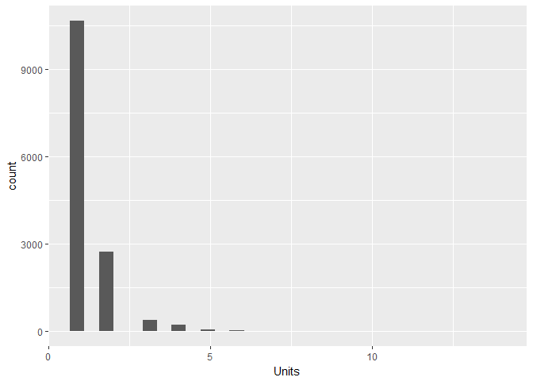
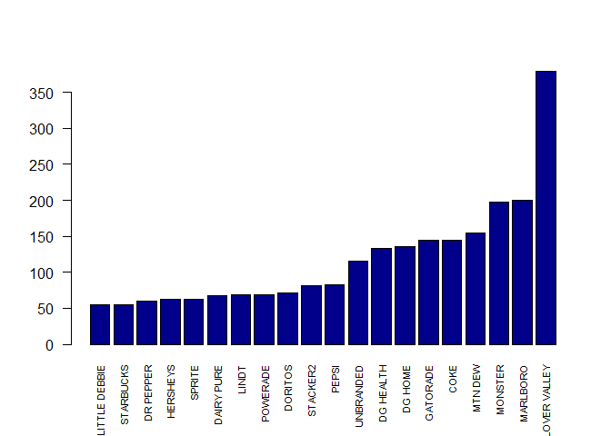

# Association Rules Mining for RB Data
Dennis Murray and Alex Deshowitz  
# Introduction

### This project seeks to use a dataset from a major retailer to create association rules for our product, RB.  Creating these associations may better help us determine whether or not to use partnerships or reward programs with our customers.  It may also help us develop customer segmentation models based upon variables such as items purchased, brands in the customer basket, and size of overall order.  Ultimately, knowing these pieces of information about our customers will help us better monetize our product, build brand-awareness, and increase brand acquisition for customers who may not have considered our product otherwise.

# Business Understanding

### This dataset was collected as part of normal operations at a major retailer.  The purpose of the collection of this information was multiple-fold.  First, this data was collected to track inventories in the store and manage supply chain interactions.  Additionally, this data was collected so that companies selling the products on the shelf in the retailer could gain better insight into product movements and shifts.  Since this data is already being collected, we can now use this information to create association rules that will allow us to better understand the customers who purchase RB.  By understanding this customer better, we will be able to translate that knowledge into better products for the customer, better placement, enhanced partnerships, and increased gross sales.

ADDRESS VALIDATION METHODS

# Data Understanding

### Overview

Our dataset was collected by a major retailer and as RB we are using this data for our analysis.  The dataset consists of 5 attributes.  The total size of our dataset is 10,263,051 records.  However, we do do some filtering in the EDA section of the framework in order to better focus on the objective of the analysis.

### Data Dictionary

**TransactionID**: The transaction ID represents each unique transaction.  There is one record for every item in                         each transaction.  This is aggregated by the item (i.e- a transaction with 2 cans of Red Bull                         will have 1 record for redbull)

**ClassDesc**: Description of the product's class.  This is a high level category the product bought falls into.
  
**DeptDesc**: This is a subset of class. 
  
**Brand**: Product's brand name as created in the item master.
  
**Units**: Units sold in the current transaction.

### Load All Packages

```r
packages<- c('plyr','data.table','dplyr','arules','arulesViz','tidyr','ggplot2','magrittr', 'sqldf')

sapply(packages, library, character.only = TRUE)
```

### Load Main dataframe

```r
BasketData<-read.csv("Data/BasketData.csv")
colnames(BasketData)<-c("TransactionID", "ClassDesc", "DeptDesc", "Brand", "Units")
BasketData$Units<-as.numeric(gsub(",", "", as.character(BasketData$Units)))
```

### EDA- Initial Integrity Checks

We always take a series of steps to ensure that our dataset is clean and does not contain errors prior to our initial data exploration.  What follows is that process:


```r
summary(BasketData)
```

```
##  TransactionID                            ClassDesc      
##  Min.   :-1.128e+09   CARBONATED DRINK-DROPSHIP: 565332  
##  1st Qu.:-1.118e+09   SALTY SNACKS-DROPSHIP    : 324499  
##  Median :-1.109e+09   CHOCOLATE CANDY          : 246999  
##  Mean   :-1.108e+09   NON-CHOCOLATE CANDY      : 180172  
##  3rd Qu.:-1.098e+09   SINGLE SERVE             : 165817  
##  Max.   :-1.074e+09   SALTY SNACKS             : 161092  
##                       (Other)                  :8619140  
##            DeptDesc                      Brand             Units         
##  CANDY & SNACKS:2820622   CLOVER VALLEY     : 708658   Min.   : -48.000  
##  FOOD          :1194796                     : 462120   1st Qu.:   1.000  
##  HOME CLEANING : 933022   DG HOME           : 423373   Median :   1.000  
##  HEALTH CARE   : 792473   UNBRANDED         : 262543   Mean   :   1.341  
##  BEAUTY CARE   : 771913   DG HEALTH         : 253359   3rd Qu.:   1.000  
##  PAPER PRODUCTS: 730928   SMART &amp; SIMPLE: 157127   Max.   :1800.000  
##  (Other)       :3019297   (Other)           :7995871
```
We notice that the dataset appears to contain negative units.  After some exploration of the data, it was determined that these values should be filtered out.  However, remember, that this is transaction data.  Therefore, we don't want to take only the negative values from the transaction.  Our assumption is that one of these values showing up in a transaction negates the entire transaction.  Therefore, some more complex filtering is necessary. We will do the filtering at the end of this process.


```r
str(BasketData)
```

```
## 'data.frame':	10263051 obs. of  5 variables:
##  $ TransactionID: int  -1121778503 -1121778503 -1121778503 -1121778503 -1121778719 -1121778719 -1127563380 -1127563380 -1127563306 -1127563306 ...
##  $ ClassDesc    : Factor w/ 747 levels "$1 TOYS","ACNE TREATMENT",..: 646 522 116 533 651 125 1 635 651 673 ...
##  $ DeptDesc     : Factor w/ 25 levels "ACCESSORIES",..: 2 3 3 3 3 23 24 3 3 7 ...
##  $ Brand        : Factor w/ 1963 levels "","1893","3 MUSKETEERS",..: 510 1714 826 877 1131 1076 899 396 826 724 ...
##  $ Units        : num  1 2 2 1 1 1 2 1 3 1 ...
```
It looks like all of the variables were read in correctly based on the datatypes. There are 1963 unique brands in the dataset, 25 different departments, and 747 different classes of those items.

Let's take a deeper look into the brands present in the dataset.


```r
dt <- data.table(BasketData)
dt <- dt[,sum(Units),by = Brand]
dt <- dt[order(V1)]

par(mfrow = c(1,1))

barplot(tail(dt$V1,20), names.arg = tail(dt$Brand,20), cex.names = 0.7, las = 2, col = 'dark blue', ylab = 'Total Units', main = 'Top-20 Brands' )
```

<!-- -->

```r
barplot(head(dt$V1,20), names.arg = head(dt$Brand,20), cex.names = 0.7, las = 2, col = 'dark blue', ylab = 'Total Units', main = 'Bottom-20 Brands' )
```

<!-- -->

```r
par(mfrow = c(1,1))
```

It looks like we have some brands that are not labeled.  We will want to filter these out of our main dataset before we do any modeling as this will not provide us further insight down the road

Let's look at the blanks to make sure.


```r
df_analysis<- BasketData[BasketData$Brand == "",]

dfa_dt <- data.table(df_analysis)
dfa_dt <- dfa_dt[,sum(Units),by = DeptDesc]
dfa_dt <- dfa_dt[order(-V1),]

barplot(head(dfa_dt$V1,20),names.arg = head(dfa_dt$DeptDesc, 20), cex.names = 0.7, las = 2, col = 'dark blue', main = 'Most frequent items with no brand')
```

<!-- -->

It looks like stationary is the most "keyed-in" item in the dataset.  There are about 100,000 records for candy and snacks that were keyed in.  While this is not ideal, to filter out candy and snack records, not having this information just introduces incomplete data.  This solidifies the fact that we should probably remove these items. We also have the luxury of having a large number of observations to build our model on.  Therefore the filtering of a couple hundred thousand records is not the end of the world.


### EDA- Tidy data filtering

Now that we know that we want to filter out the records with no brand and the records with negative values for individual scans within the transaction, we have to do some interesting filtering.

In order to maintain the integrity of our model, we have to come up with a way to filter the data that allows us to 1.) identify  the transactions that contain negative values 2.) filter out those entire transactions.  

Given that we have such a large dataset, we can afford to filter out entire transactions that contain partial bad records.  While some of these transactions do more than likely contain valid transaction-portions, we cannot be certain.  Therefore, the more conservative approach when thinking about association rule creation is to not risk leaving in partial records that could represent bad data.  We will use the SQLdf package for this portion of the analysis.


```r
# let's take out the transactions that contain negative values
# notice that we are taking out distinct transactions and not just those items. 
# this ensures that we get whole itemsets that are not incomplete
BasketData<- sqldf('Select TransactionID, ClassDesc, DeptDesc, Brand, Units
                   From BasketData Where TransactionID Not In  
                   (Select Distinct
                   TransactionID
                   From BasketData
                   Where 
                   Units<=0)')
```

```
## Loading required package: tcltk
```

```
## Warning: Quoted identifiers should have class SQL, use DBI::SQL() if the
## caller performs the quoting.
```

```r
# ok, that looks like it worked.  Now, we need to see what removal of the transactions without any brand looks like

BasketData<- sqldf('Select TransactionID, ClassDesc, DeptDesc, Brand, Units
                   From BasketData Where TransactionID Not In  
                   (Select Distinct
                   TransactionID
                   From BasketData
                   Where 
                   Brand="")')
```


### EDA- Learning the Data

How many transactions contain Redbull?


```r
df_analysis_redbull<- BasketData[BasketData$Brand == "RED BULL",]

length(unique(df_analysis_redbull$TransactionID)) # 14046 transactions have redbull
```

```
## [1] 14046
```

```r
length(unique(BasketData$TransactionID))# 2493458
```

```
## [1] 2493458
```
What percentage of transactions is this?


```r
length(unique(df_analysis_redbull$TransactionID))/
  length(unique(BasketData$TransactionID)) # looks like about 0.56% of all transactions have a redbull
```

```
## [1] 0.005633141
```

What Class is Red Bull?


```r
unique(df_analysis_redbull$ClassDesc)
```

```
## [1] NON-CARBONATED DROPSHIP
## 747 Levels: $1 TOYS ACNE TREATMENT ADHESIVES ... YOUTH SS GIRL
```

It is really interesting that RedBull is in the non-carbonated class

How many redbulls does the average transaction contain?


```r
print('mean:')
```

```
## [1] "mean:"
```

```r
mean(df_analysis_redbull$Units)
```

```
## [1] 1.32422
```

```r
print('max:')
```

```
## [1] "max:"
```

```r
max(df_analysis_redbull$Units)
```

```
## [1] 14
```

```r
print('min:')
```

```
## [1] "min:"
```

```r
min(df_analysis_redbull$Units)
```

```
## [1] 1
```
Looks like about 1.3 units and somebody purchased about 14 units.

What does the distribution of purchased look like? It is probably highly skewed to 1-item purchases.


```r
qplot(Units, data = df_analysis_redbull, geom = 'histogram')
```

```
## `stat_bin()` using `bins = 30`. Pick better value with `binwidth`.
```

<!-- -->
Just as we thought based on the analysis, mostly one and two can purchases

What is RedBull's candy & snacks transaction share?


```r
print('Number of candy and snack transactions:' )
```

```
## [1] "Number of candy and snack transactions:"
```

```r
length(unique(BasketData$TransactionID[BasketData$DeptDesc=='CANDY & SNACKS'])) # 1,217,781 with candy or snacks
```

```
## [1] 1217781
```

```r
print('Number of total transactions:' )
```

```
## [1] "Number of total transactions:"
```

```r
length(unique(BasketData$TransactionID)) #2,493,458 total transactions
```

```
## [1] 2493458
```

```r
print('Percent of transactions with candy and snacks: ')
```

```
## [1] "Percent of transactions with candy and snacks: "
```

```r
length(unique(BasketData$TransactionID[BasketData$DeptDesc=='CANDY & SNACKS']))/length(unique(BasketData$TransactionID))
```

```
## [1] 0.4883904
```

```r
print('Percent of candy and snack transactions with RedBull: ')
```

```
## [1] "Percent of candy and snack transactions with RedBull: "
```

```r
length(unique(df_analysis_redbull$TransactionID))/length(unique(BasketData$TransactionID[BasketData$DeptDesc=='CANDY & SNACKS']))
```

```
## [1] 0.01153409
```

```r
# 1.1% of candy or snack transactions contain redbull
```

Alright, it looks like nearly 50% of the transactions in our dataset are in the candy and snacks department, which is the same department as redbull.  

1.1% of all candy and snack transactions contain redbull

I wonder what the biggest competitor looks lik?


```r
df_analysis_monster<- BasketData[BasketData$Brand == "MONSTER",]

length(unique(df_analysis_monster$TransactionID)) # 25,338 transactions have Monster
```

```
## [1] 25338
```

About 25,338 transactions contain Monster; however, the do alot of 2-4-1 offers, so we need to account for that when thinking about things like transaction size.


```r
print('mean:')
```

```
## [1] "mean:"
```

```r
mean(df_analysis_monster$Units)
```

```
## [1] 1.509275
```

```r
print('max:')
```

```
## [1] "max:"
```

```r
max(df_analysis_monster$Units)
```

```
## [1] 47
```

```r
print('min:')
```

```
## [1] "min:"
```

```r
min(df_analysis_monster$Units)
```

```
## [1] 1
```

```r
print('percentage higher than redbull:' )
```

```
## [1] "percentage higher than redbull:"
```

```r
mean(df_analysis_monster$Units)/mean(df_analysis_redbull$Units)-1
```

```
## [1] 0.1397458
```
Just as suspected, the average transaction amount is a tad higher.  We may want to look at the transaction distribution, despite the fact that it will have a very high positive skew due to all of the 1-item transactions.


```r
par(mfrow = c(1,2))

# create the dataframe
rb <- data.frame(rep('RedBull', length(unique(df_analysis_redbull$TransactionID))))
df1<- cbind(rb, data.frame(df_analysis_redbull$Units))
colnames(df1) = c('brand','units')

mon <- data.frame(rep('Monster', length(unique(df_analysis_monster$TransactionID))))
df2<- cbind(mon, data.frame(df_analysis_monster$Units))
colnames(df2) = c('brand','units')


df3<- rbind(df1,df2)

boxplot(units~brand, data = df3)

# looks like 42 from Monster skews things a bit, let's filter it

df3<- df3[df3$units<30,]

boxplot(units~brand, data = df3)
```

<!-- -->

```r
par(mfrow = c(1,1))
```
Ok, it doesnt look like their distributions are really that much different.  Both have a high degree of positive skew.

We would like to look at Redbull on a transaction level next.  This will help us better understand the rules that we get out of our model.

How many items are purchased in each Redbull transaction?


```r
# How many items are purchased in each redbull transaction?

redbull_items_purchased<-sqldf('select avg(brands) As num_brands, avg(total_units) As avg_units From
                               (select TransactionID,count(Distinct(Brand)) As brands,
                               Sum(Units) AS total_units  From BasketData Where 
                               TransactionID in (select distinct TransactionID From BasketData Where Brand = "RED BULL") Group By 1)' )

print(redbull_items_purchased)
```

```
##   num_brands avg_units
## 1   3.869287  5.257867
```
On average, there are about 5.3 units in each transaction.  We also see that there are fewer brands.  Therefore, this means that something is getting purchased multiple times in the transaction. Let's hope it is RB.

Are most transactions Redbull by itself?


```r
redbull_plus_snack_df<-sqldf('select TransactionID, ClassDesc, DeptDesc, Brand, Units  From BasketData Where 
                             TransactionID in (select distinct TransactionID From BasketData Where Brand = "RED BULL")
                             And Brand<> "RED BULL"')

length(unique(redbull_plus_snack_df$TransactionID)) 
```

```
## [1] 11375
```
Alright, the vast majority of Redbull transactions contain alot more than one item.

Ok, which brands are most often purchased with RB?


```r
brand_df<- sqldf('Select Brand, Count(*) As trans, Sum(Units) As units_purch  From redbull_plus_snack_df Group By 1 Order By 3')


barplot(tail(brand_df$units_purch,20), names.arg = tail(brand_df$Brand,20), cex.names = 0.7, las = 2, col = 'dark blue' )
```

<!-- -->

It looks like we have some store brands, and unbranded category (SHOULD WE FILTER OUT?).  Wow!  Monster is the next most purchased, followed by Mountain Dew. It is really interesting.  Lots of energy products are purchased together and junk food also appears to be very popular.

That's nice, but which department are these items in?


```r
department_df<- sqldf('Select DeptDesc, Count(*) As trans, Sum(Units) As units_purch  From redbull_plus_snack_df Group By 1 Order By 3')

barplot(tail(department_df$units_purch,20), names.arg = tail(department_df$DeptDesc,20), cex.names = 0.7, las = 2, col = 'dark blue' )
```

<!-- -->
Just as we saw earlier, candy and snacks dominate.


Which classes do these encompass?


```r
class_df<- sqldf('Select ClassDesc, Count(*) As trans, Sum(Units) As units_purch  From redbull_plus_snack_df Group By 1 Order By 3')

barplot(tail(class_df$units_purch,20), names.arg = tail(class_df$ClassDesc,20), cex.names = 0.7, las = 2 , col ='dark blue')
```

<!-- -->

So the non-carbonated looks high.  However, now we see that cigarettes are pretty popular compliments to the Redbull


I wonder which candy and snacks are most popular with RedBull?


```r
candy_snack_df<- sqldf('Select Brand, Count(*) As trans, Sum(Units) As units_purch  
                       From redbull_plus_snack_df Where DeptDesc ="CANDY & SNACKS" Group By 1 Order By 3')

barplot(tail(candy_snack_df$units_purch,20), names.arg = tail(candy_snack_df$Brand,20), cex.names = 0.7, las = 2 , col = 'dark blue')
```

<!-- -->
All soft drinks and doritos. We can see that it might be appealing to have a little sweet and savory.  However, it looks like sweets are also a favorite, with little debbies and Hersheys being up next.


Something we have to jump into now is the idea of different combinations of transactions.  We should probably group the dataset by the number of items in each transaction.  This will help us better interpret the rules that we get out of the model.  It also may help us set our values for minsup, etc.


```r
# add dimension to the dataset

redbull_brands_in_trans<-sqldf('select T1.TransactionID As TransactionID ,brands, ClassDesc, DeptDesc, Brand, Units  
                               From BasketData As T1
                               Inner Join ( Select TransactionID, Count(Distinct(Brand)) As brands From BasketData Group By 1) As T2
                               On T1.TransactionID = T2.TransactionID
                               Where T1.TransactionID in (select distinct TransactionID From BasketData Where Brand = "RED BULL")')
```

Transactions with 2 brands


```r
# 2 brand transactions (filter out RB)

two_brand_trans<- sqldf('select brand, sum(Units) As units From redbull_brands_in_trans
                        Where
                        Brand <> "RED BULL"
                        And brands = 2
                        Group By 1
                        Order By 2
                        
                        ')

barplot(tail(two_brand_trans$units,20), names.arg = tail(two_brand_trans$Brand,20), cex.names = 0.7, las = 2 )
```

<!-- -->
So, a few things start to shake out here.  We see that in 2 brand transactions Marlboros are very popular.  This is of course followed by Monster.  

Transactions with 3 brands


```r
# 3 brand transactions (filter out RB)

three_brand_trans<- sqldf('select brand, sum(Units) As units From redbull_brands_in_trans
                          Where
                          Brand <> "RED BULL"
                          And brands = 3
                          Group By 1
                          Order By 2
                          
                          ')

barplot(tail(three_brand_trans$units,20), names.arg = tail(three_brand_trans$Brand,20), cex.names = 0.7, las = 2 )
```

<!-- -->
As we start adding more items, store brands start to become a larger proportion.  This is probably a customer who comes in for one thing and picks up some smokes and an energy boost while they are at it.


Transactions with 4 brands


```r
four_brand_trans<- sqldf('select brand, sum(Units) As units From redbull_brands_in_trans
                         Where
                         Brand <> "RED BULL"
                         And brands = 4
                         Group By 1
                         Order By 2
                         
                         ')

barplot(tail(four_brand_trans$units,20), names.arg = tail(four_brand_trans$Brand,20), cex.names = 0.7, las = 2 )
```

<!-- -->
So, it looks like folks who come in for more than 3 distinct items still like to purchase other energy drinks, but cigarettes occur in fewer transactions.  Store brands also become much more popular.

Transactions with 5 brands


```r
five_brand_trans<- sqldf('select brand, sum(Units) As units From redbull_brands_in_trans
                         Where
                         Brand <> "RED BULL"
                         And brands = 5
                         Group By 1
                         Order By 2
                         
                         ')

barplot(tail(five_brand_trans$units,20), names.arg = tail(five_brand_trans$Brand,20), cex.names = 0.7, las = 2 )
```

<!-- -->

It looks like home products really jump up with 5 items.  We definitely see alot of consistency in the top 10 brands that are all purchased together though.

That being said, we would like a better way of associating these products together than simple visual analytics.  It would be really nice to be able to look at significant rules and baskets that occur very frequently as it is obviously very cumbersome to do with nearly 2000 brands.


