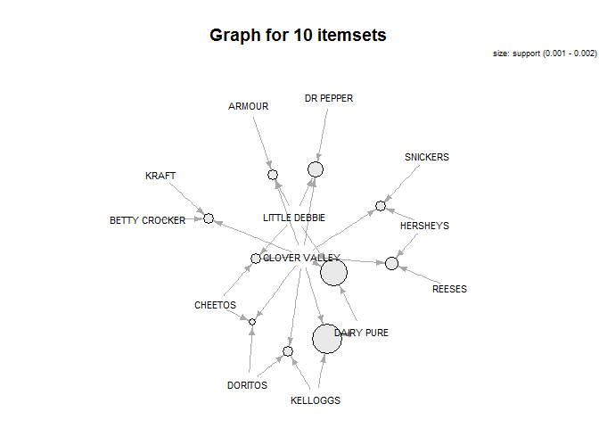
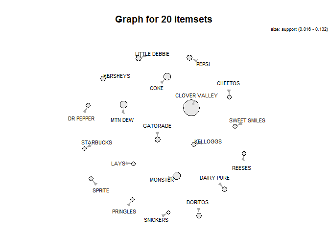

# Association Rules Mining for RB Data
Dennis Murray and Alex Deshowitz <br> Southern Methodist University- MSDS 7331 <br> April 23, 2017  
#**Executive Summary**
   In this project we created a series of rules based on different categorical breakdowns of items purchased in conjunction with the Red Bull beverage product.  Overall, we found that baskets including Little Debbie snack cakes and 5-hr Energy to be interesting baskets as measured by confidence.  Additionally, we found that certain product categories tend to occur together, albeit with lower support than we might have wished for.  That being said, in future rules association creation, we might consider bringing in SKU and geolocation data in order to improve the model and create more actionable rules.  In addition to the redbull rules, we tried modeling out the entire dataset for all rules at the brand level.  This approach caused us to run out of available memory in R.  For future solves, we might consider taking random-stratified samples that allow us to maintain the same distributions in the training data.

#**Introduction**

  This project seeks to use a dataset from a major retailer to create association rules for our product, RB.  Creating these associations may better help us determine whether or not to use partnerships or reward programs with our customers.  It may also help us develop customer segmentation models based upon variables such as items purchased, brands in the customer basket, and size of overall order.  Ultimately, knowing these pieces of information about our customers will help us better monetize our product, build brand-awareness, and increase brand acquisition for customers who may not have considered our product otherwise.

#**Business Understanding**

  This dataset was collected as part of normal operations at a major retailer.  The purpose of the collection of this information was multiple-fold.  First, this data was collected to track inventories in the store and manage supply chain interactions.  Additionally, this data was collected so that companies selling the products on the shelf in the retailer could gain better insight into product movements and shifts.  Since this data is already being collected, we can now use this information to create association rules that will allow us to better understand the customers who purchase RB.  By understanding this customer better, we will be able to translate that knowledge into better products for the customer, better placement, enhanced partnerships, and increased gross sales.

ADDRESS VALIDATION METHODS

# **Data Understanding**

###Overview

Our dataset was collected by a major retailer and as RB we are using this data for our analysis.  The dataset consists of 5 attributes.  The total size of our dataset is 10,263,051 records.  However, we do do some filtering in the EDA section of the framework in order to better focus on the objective of the analysis.

The collection of this data occurs on an automated basis via the retailer's point-of-sale system.  At the cash register, scanning of the UPC barcode records the specific item, and the quantity of the item, purchased.  This data is transmitted on a daily basis to a third-party aggregator that compiles transactions from all of the retailer's stores, and makes the data available to the retailer's vendor partners for analysis.  In the case of RB, daily data is comprised of items in the same category.  Once per quarter, the aggregator makes available the complete transactional history that can be used for a complete basket analysis.

The 10.2MM records included in this analysis comprise a limited view of the retailer's business.  In fact, it is just one week of data, for a specific physical store format labeled as "Traditional" that comprises about 20% of the retailer's store count.  The data was aggregated from the SKU (UPC or Item Barcode level) to the Department/Class/Brand level.  While this removed the specficity of working at an item level, working at the item level would have reduced the support for anyone transaction type to a much lower level, with each Department/Class/Brand having possibly dozens to hundreds of UPCs available.  Thus, one part of our exploratory data analysis will be comprised of determining the appropriate level of detail to work from to mine the data rules for our analysis.

It is important to also understand that in the context of the retailer, there could be significant variation in basket contents depending on time of the year and this week may not be representative of all time periods of the year.  A broader time sample would be required to properly gauge the variation throughout the year.

It is suspected that we may uncover several different shopping missions.  Based on prior knowledge, we might expect that Tobacco, and snack food will be purchased alongside the targeted brand, Red Bull.  Other beverage items, like water, are also known to be purchased alongside of Red Bull.

### Data Dictionary

**TransactionID**: The transaction ID represents each unique transaction.  There is one record for every item in                         each transaction.  This is aggregated by the item (i.e- a transaction with 2 cans of Red Bull                         will have 1 record for redbull)

**ClassDesc**: Description of the product's class.  This is a high level category the product bought falls into.
  
**DeptDesc**: This is a subset of class. 
  
**Brand**: Product's brand name as created in the item master.  It is important to realize that the Item Master is human-managed, and thus may not be a perfect representation of the 
  
**Units**: Units sold in the current transaction.

### Load All Packages

```r
packages<- c('plyr','data.table','dplyr','arules','arulesViz','tidyr','ggplot2','magrittr', 'sqldf', 'scales', 'jpeg')

sapply(packages, library, character.only = TRUE)
```

```
## Warning: package 'arules' was built under R version 3.3.3
```

```
## Warning: package 'arulesViz' was built under R version 3.3.3
```

```
## Warning: package 'sqldf' was built under R version 3.3.3
```

```
## Warning: package 'gsubfn' was built under R version 3.3.3
```

```
## Warning: package 'RSQLite' was built under R version 3.3.3
```

### Load Main dataframe

```r
BasketData<-read.csv("Data/BasketData.csv")
colnames(BasketData)<-c("TransactionID", "ClassDesc", "DeptDesc", "Brand", "Units")
BasketData$Units<-as.numeric(gsub(",", "", as.character(BasketData$Units)))
```

### **EDA- Initial Integrity Checks**

We always take a series of steps to ensure that our dataset is clean and does not contain errors prior to our initial data exploration.  What follows is that process:


```r
summary(BasketData)
```

```
##  TransactionID                            ClassDesc      
##  Min.   :-1.128e+09   CARBONATED DRINK-DROPSHIP: 565332  
##  1st Qu.:-1.118e+09   SALTY SNACKS-DROPSHIP    : 324499  
##  Median :-1.109e+09   CHOCOLATE CANDY          : 246999  
##  Mean   :-1.108e+09   NON-CHOCOLATE CANDY      : 180172  
##  3rd Qu.:-1.098e+09   SINGLE SERVE             : 165817  
##  Max.   :-1.074e+09   SALTY SNACKS             : 161092  
##                       (Other)                  :8619140  
##            DeptDesc                      Brand             Units         
##  CANDY & SNACKS:2820622   CLOVER VALLEY     : 708658   Min.   : -48.000  
##  FOOD          :1194796                     : 462120   1st Qu.:   1.000  
##  HOME CLEANING : 933022   DG HOME           : 423373   Median :   1.000  
##  HEALTH CARE   : 792473   UNBRANDED         : 262543   Mean   :   1.341  
##  BEAUTY CARE   : 771913   DG HEALTH         : 253359   3rd Qu.:   1.000  
##  PAPER PRODUCTS: 730928   SMART &amp; SIMPLE: 157127   Max.   :1800.000  
##  (Other)       :3019297   (Other)           :7995871
```
We notice that the dataset appears to contain negative units.  After some exploration of the data, it was determined that these values should be filtered out.  However, remember, that this is transaction data.  Therefore, we don't want to take only the negative values from the transaction.  Our assumption is that one of these values showing up in a transaction negates the entire transaction.  Therefore, some more complex filtering is necessary. We will do the filtering at the end of this process.


```r
str(BasketData)
```

```
## 'data.frame':	10263051 obs. of  5 variables:
##  $ TransactionID: int  -1121778503 -1121778503 -1121778503 -1121778503 -1121778719 -1121778719 -1127563380 -1127563380 -1127563306 -1127563306 ...
##  $ ClassDesc    : Factor w/ 747 levels "$1 TOYS","ACNE TREATMENT",..: 646 522 116 533 651 125 1 635 651 673 ...
##  $ DeptDesc     : Factor w/ 25 levels "ACCESSORIES",..: 2 3 3 3 3 23 24 3 3 7 ...
##  $ Brand        : Factor w/ 1963 levels "","1893","3 MUSKETEERS",..: 510 1714 826 877 1131 1076 899 396 826 724 ...
##  $ Units        : num  1 2 2 1 1 1 2 1 3 1 ...
```
It looks like all of the variables were read in correctly based on the datatypes. There are 1963 unique brands in the dataset, 25 different departments, and 747 different classes of those items.

Let's take a deeper look into the brands present in the dataset.


```r
dt <- data.table(BasketData)
dt <- dt[,sum(Units),by = Brand]
dt <- dt[order(V1)]

par(mfrow = c(1,1))

barplot(tail(dt$V1,20), names.arg = tail(dt$Brand,20), cex.names = 0.7, las = 2, col = 'dark blue', ylab = 'Total Units', main = 'Top-20 Brands' )
```

<!-- -->

```r
barplot(head(dt$V1,20), names.arg = head(dt$Brand,20), cex.names = 0.7, las = 2, col = 'dark blue', ylab = 'Total Units', main = 'Bottom-20 Brands' )
```

<!-- -->

```r
par(mfrow = c(1,1))
```

It looks like we have some brands that are not labeled.  We will want to filter these out of our main dataset before we do any modeling as this will not provide us further insight down the road

Let's look at the blanks to make sure.


```r
df_analysis<- BasketData[BasketData$Brand == "",]

dfa_dt <- data.table(df_analysis)
dfa_dt <- dfa_dt[,sum(Units),by = DeptDesc]
dfa_dt <- dfa_dt[order(-V1),]

barplot(head(dfa_dt$V1,20),names.arg = head(dfa_dt$DeptDesc, 20), cex.names = 0.7, las = 2, col = 'dark blue', main = 'Most frequent items with no brand')
```

<!-- -->

It looks like stationary is the most "keyed-in" item in the dataset.  There are about 100,000 records for candy and snacks that were keyed in.  While this is not ideal, to filter out candy and snack records, not having this information just introduces incomplete data.  This solidifies the fact that we should probably remove these items. We also have the luxury of having a large number of observations to build our model on.  Therefore the filtering of a couple hundred thousand records is not the end of the world.


### **EDA- Tidy data filtering**

Now that we know that we want to filter out the records with no brand and the records with negative values for individual scans within the transaction, we have to do some interesting filtering.

In order to maintain the integrity of our model, we have to come up with a way to filter the data that allows us to 1.) identify  the transactions that contain negative values 2.) filter out those entire transactions.  

Given that we have such a large dataset, we can afford to filter out entire transactions that contain partial bad records.  While some of these transactions do more than likely contain valid transaction-portions, we cannot be certain.  Therefore, the more conservative approach when thinking about association rule creation is to not risk leaving in partial records that could represent bad data.  We will use the SQLdf package for this portion of the analysis.


```r
# let's take out the transactions that contain negative values
# notice that we are taking out distinct transactions and not just those items. 
# this ensures that we get whole itemsets that are not incomplete
BasketData<- sqldf('Select TransactionID, ClassDesc, DeptDesc, Brand, Units
                   From BasketData Where TransactionID Not In  
                   (Select Distinct
                   TransactionID
                   From BasketData
                   Where 
                   Units<=0)')
```

```
## Loading required package: tcltk
```

```
## Warning: Quoted identifiers should have class SQL, use DBI::SQL() if the
## caller performs the quoting.
```

```r
# ok, that looks like it worked.  Now, we need to see what removal of the transactions without any brand looks like

BasketData<- sqldf('Select TransactionID, ClassDesc, DeptDesc, Brand, Units
                   From BasketData Where TransactionID Not In  
                   (Select Distinct
                   TransactionID
                   From BasketData
                   Where 
                   Brand="")')
```


### **EDA- Learning the Data**

How many transactions contain Redbull?


```r
df_analysis_redbull<- BasketData[BasketData$Brand == "RED BULL",]

length(unique(df_analysis_redbull$TransactionID)) # 14046 transactions have redbull
```

```
## [1] 14046
```

```r
length(unique(BasketData$TransactionID))# 2493458
```

```
## [1] 2493458
```
What percentage of transactions is this?


```r
length(unique(df_analysis_redbull$TransactionID))/
  length(unique(BasketData$TransactionID)) # looks like about 0.56% of all transactions have a redbull
```

```
## [1] 0.005633141
```

What Class is Red Bull?


```r
unique(df_analysis_redbull$ClassDesc)
```

```
## [1] NON-CARBONATED DROPSHIP
## 747 Levels: $1 TOYS ACNE TREATMENT ADHESIVES ... YOUTH SS GIRL
```

Red Bull is categorized into the Non-carbonated drop ship class. Creation of this class is a legacy of the category management of non-alcoholic beverage primarily by the two major beverage companies - Coke and Pepsi - and their dichotomy of products between their main product lines, Carbonated Soft Drinks, and everything else.  Energy Drinks, when created in the late 90s and early 2000s were considered to be part of the "Everything else" by these companies. 

How many redbulls does the average transaction contain?


```r
mean(df_analysis_redbull$Units)
```

```
## [1] 1.32422
```

```r
max(df_analysis_redbull$Units)
```

```
## [1] 14
```

```r
min(df_analysis_redbull$Units)
```

```
## [1] 1
```
Looks like about 1.3 units and somebody purchased about 14 units.

What does the distribution of purchased look like? It is probably highly skewed to 1-item purchases.


```r
qplot(Units, data = df_analysis_redbull, geom = 'histogram')
```

```
## `stat_bin()` using `bins = 30`. Pick better value with `binwidth`.
```

<!-- -->

Just as we thought based on the analysis, mostly one and two can purchases

What is RedBull's candy & snacks transaction share?


```r
print('Number of candy and snack transactions:' )
```

```
## [1] "Number of candy and snack transactions:"
```

```r
length(unique(BasketData$TransactionID[BasketData$DeptDesc=='CANDY & SNACKS'])) # 1,217,781 with candy or snacks
```

```
## [1] 1217781
```

```r
print('Number of total transactions:' )
```

```
## [1] "Number of total transactions:"
```

```r
length(unique(BasketData$TransactionID)) #2,493,458 total transactions
```

```
## [1] 2493458
```

```r
print('Percent of transactions with candy and snacks: ')
```

```
## [1] "Percent of transactions with candy and snacks: "
```

```r
length(unique(BasketData$TransactionID[BasketData$DeptDesc=='CANDY & SNACKS']))/length(unique(BasketData$TransactionID))
```

```
## [1] 0.4883904
```

```r
print('Percent of candy and snack transactions with RedBull: ')
```

```
## [1] "Percent of candy and snack transactions with RedBull: "
```

```r
length(unique(df_analysis_redbull$TransactionID))/length(unique(BasketData$TransactionID[BasketData$DeptDesc=='CANDY & SNACKS']))
```

```
## [1] 0.01153409
```

```r
# 1.1% of candy or snack transactions contain redbull
```

Alright, it looks like nearly 50% of the transactions in our dataset are in the candy and snacks department, which is the same department as redbull.  

1.1% of all candy and snack transactions contain Red Bull.

I wonder what the biggest competitor looks like?


```r
df_analysis_monster<- BasketData[BasketData$Brand == "MONSTER",]

length(unique(df_analysis_monster$TransactionID)) # 25,338 transactions have Monster
```

```
## [1] 25338
```

About 25,338 transactions contain Monster;however, Monster's transaction size may also be associated with their pricing and promotional programming, which commonly calls for two items to be purchased to receive the lower price.  Monster's broader product line, with more flavors and product types - including ready-to-drink Coffee - may also create a "Mix and Match" basket for a shopper.  (This could be another interesting analysis.)


```r
print('mean:')
```

```
## [1] "mean:"
```

```r
mean(df_analysis_monster$Units)
```

```
## [1] 1.509275
```

```r
print('max:')
```

```
## [1] "max:"
```

```r
max(df_analysis_monster$Units)
```

```
## [1] 47
```

```r
print('min:')
```

```
## [1] "min:"
```

```r
min(df_analysis_monster$Units)
```

```
## [1] 1
```

```r
print('percentage higher than redbull:' )
```

```
## [1] "percentage higher than redbull:"
```

```r
mean(df_analysis_monster$Units)/mean(df_analysis_redbull$Units)-1
```

```
## [1] 0.1397458
```
Just as suspected, the average transaction amount is a tad higher.  We may want to look at the transaction distribution, despite the fact that it will have a very high positive skew due to all of the 1-item transactions.


```r
par(mfrow = c(1,2))

# create the dataframe
rb <- data.frame(rep('RedBull', length(unique(df_analysis_redbull$TransactionID))))
df1<- cbind(rb, data.frame(df_analysis_redbull$Units))
colnames(df1) = c('brand','units')

mon <- data.frame(rep('Monster', length(unique(df_analysis_monster$TransactionID))))
df2<- cbind(mon, data.frame(df_analysis_monster$Units))
colnames(df2) = c('brand','units')


df3<- rbind(df1,df2)

boxplot(units~brand, data = df3)

# looks like 42 from Monster skews things a bit, let's filter it

df3<- df3[df3$units<30,]

boxplot(units~brand, data = df3)
```

<!-- -->

```r
par(mfrow = c(1,1))
```
Ok, it doesnt look like their distributions are really that much different.  Both have a high degree of positive skew.

We would like to look at Redbull on a transaction level next.  This will help us better understand the rules that we get out of our model.

How many items are purchased in each Redbull transaction?


```r
# How many items are purchased in each redbull transaction?

redbull_items_purchased<-sqldf('select avg(brands) As num_brands, avg(total_units) As avg_units From
                               (select TransactionID,count(Distinct(Brand)) As brands,
                               Sum(Units) AS total_units  From BasketData Where 
                               TransactionID in (select distinct TransactionID From BasketData Where Brand = "RED BULL") Group By 1)' )

print(redbull_items_purchased)
```

```
##   num_brands avg_units
## 1   3.869287  5.257867
```
On average, there are about 5.3 units in each transaction.  We also see that there are fewer brands.  Therefore, this means that something is getting purchased multiple times in the transaction. Let's hope it is RB.

Are most transactions Redbull by itself?


```r
redbull_plus_snack_df<-sqldf('select TransactionID, ClassDesc, DeptDesc, Brand, Units  From BasketData Where 
                             TransactionID in (select distinct TransactionID From BasketData Where Brand = "RED BULL")
                             And Brand<> "RED BULL"')

length(unique(redbull_plus_snack_df$TransactionID)) 
```

```
## [1] 11375
```
Alright, the vast majority of Redbull transactions contain alot more than one item.

Ok, which brands are most often purchased with RB?


```r
brand_df<- sqldf('Select Brand, Count(*) As trans, Sum(Units) As units_purch  From redbull_plus_snack_df Group By 1 Order By 3')


barplot(tail(brand_df$units_purch,20), names.arg = tail(brand_df$Brand,20), cex.names = 0.7, las = 2, col = 'dark blue' )
```

<!-- -->

It looks like we have some store brands, and unbranded category.  Unbranded items are actually really common for this retailer - occurring most often in Home Decor, Stationery, Sundries, and Shoes for Departments.

Wow!  Monster is the next most purchased, followed by Mountain Dew. It is really interesting.  Lots of beverage and energy products are purchased together and junk food also appears to be very popular.

That's nice, but which department are these items in?


```r
department_df<- sqldf('Select DeptDesc, Count(*) As trans, Sum(Units) As units_purch  From redbull_plus_snack_df Group By 1 Order By 3')

barplot(tail(department_df$units_purch,20), names.arg = tail(department_df$DeptDesc,20), cex.names = 0.7, las = 2, col = 'dark blue' )
```

<!-- -->
Just as we saw earlier, candy and snacks dominate.


Which classes do these encompass?


```r
class_df<- sqldf('Select ClassDesc, Count(*) As trans, Sum(Units) As units_purch  From redbull_plus_snack_df Group By 1 Order By 3')

barplot(tail(class_df$units_purch,20), names.arg = tail(class_df$ClassDesc,20), cex.names = 0.7, las = 2 , col ='dark blue')
```

<!-- -->

So the non-carbonated looks high.  However, now we see that cigarettes are pretty popular compliments to the Redbull.


I wonder which candy and snacks are most popular with RedBull?


```r
candy_snack_df<- sqldf('Select Brand, Count(*) As trans, Sum(Units) As units_purch  
                       From redbull_plus_snack_df Where DeptDesc ="CANDY & SNACKS" Group By 1 Order By 3')

barplot(tail(candy_snack_df$units_purch,20), names.arg = tail(candy_snack_df$Brand,20), cex.names = 0.7, las = 2 , col = 'dark blue')
```

<!-- -->
All soft drinks and doritos. We can see that it might be appealing to have a little sweet and savory.  However, it looks like sweets are also a favorite, with little debbies and Hersheys being up next.


Something we have to jump into now is the idea of different combinations of transactions.  We should probably group the dataset by the number of items in each transaction.  This will help us better interpret the rules that we get out of the model as interesting or not.  It also may help us set our values for minsup, etc.


```r
# add dimension to the dataset

redbull_brands_in_trans<-sqldf('select T1.TransactionID As TransactionID ,brands, ClassDesc, DeptDesc, Brand, Units  
                               From BasketData As T1
                               Inner Join ( Select TransactionID, Count(Distinct(Brand)) As brands From BasketData Group By 1) As T2
                               On T1.TransactionID = T2.TransactionID
                               Where T1.TransactionID in (select distinct TransactionID From BasketData Where Brand = "RED BULL")')
```

**Transactions with 2 brands**


```r
# 2 brand transactions (filter out RB)

two_brand_trans<- sqldf('select brand, sum(Units) As units From redbull_brands_in_trans
                        Where
                        Brand <> "RED BULL"
                        And brands = 2
                        Group By 1
                        Order By 2
                        
                        ')

barplot(tail(two_brand_trans$units,20), names.arg = tail(two_brand_trans$Brand,20), cex.names = 0.7, las = 2, col = 'dark blue' )
```

<!-- -->
So, a few things start to shake out here.  We see that in 2 brand transactions Marlboros are very popular.  This is of course followed by Monster.  

**Transactions with 3 brands**


```r
# 3 brand transactions (filter out RB)

three_brand_trans<- sqldf('select brand, sum(Units) As units From redbull_brands_in_trans
                          Where
                          Brand <> "RED BULL"
                          And brands = 3
                          Group By 1
                          Order By 2
                          
                          ')

barplot(tail(three_brand_trans$units,20), names.arg = tail(three_brand_trans$Brand,20), cex.names = 0.7, las = 2, col ='dark blue'
        )
```

<!-- -->
As we start adding more items, store brands start to become a larger proportion.  This is probably a customer who comes in for one thing and picks up some smokes and an energy boost while they are at it.


**Transactions with 4 brands**


```r
four_brand_trans<- sqldf('select brand, sum(Units) As units From redbull_brands_in_trans
                         Where
                         Brand <> "RED BULL"
                         And brands = 4
                         Group By 1
                         Order By 2
                         
                         ')

barplot(tail(four_brand_trans$units,20), names.arg = tail(four_brand_trans$Brand,20), cex.names = 0.7, las = 2, col = 'dark blue' )
```

<!-- -->
So, it looks like folks who come in for more than 3 distinct items still like to purchase other energy drinks, but cigarettes occur in fewer transactions.  Store brands also become much more popular.

**Transactions with 5 brands**


```r
five_brand_trans<- sqldf('select brand, sum(Units) As units From redbull_brands_in_trans
                         Where
                         Brand <> "RED BULL"
                         And brands = 5
                         Group By 1
                         Order By 2
                         
                         ')

barplot(tail(five_brand_trans$units,20), names.arg = tail(five_brand_trans$Brand,20), cex.names = 0.7, las = 2, col= 'dark blue' )
```

<!-- -->

It looks like home products really jump up with 5 items.  We definitely see alot of consistency in the top 10 brands that are all purchased together though.

That being said, we would like a better way of associating these products together than simple visual analytics.  It would be really nice to be able to look at significant rules and baskets that occur very frequently as it is obviously very cumbersome to do with nearly 2000 brands.

### **Association Rules**

####**Overview**

For the first sets of rules, we will really trim down the dataset substantially. We will only look at transactions that contained redbull as we are most interested in the rules associated with those transactions.  We will then show transactional rules for product classes and all products in the entire dataset.  By creating rules for the entire set, we can see if there are any interesting baskets of data that Redbull should want to be a part of in the future.

####Redbull Transactions- Brand Level Rules

We will use a filtered dataframe to produce rules around just the purchases that include RedBull


```r
redbull_arules<-sqldf('select TransactionID, ClassDesc, DeptDesc, Brand, Units  From BasketData Where 
                             TransactionID in (select distinct TransactionID From BasketData Where Brand = "RED BULL")
                             ')
```


```r
head(redbull_arules)
```

```
##   TransactionID               ClassDesc       DeptDesc          Brand
## 1   -1121778412 NON-CARBONATED DROPSHIP CANDY & SNACKS         LIPTON
## 2   -1121778412 NON-CARBONATED DROPSHIP CANDY & SNACKS       RED BULL
## 3   -1121778412                   JUICE           FOOD  SUNNY DELIGHT
## 4   -1121778412              CIGARETTES        TOBACCO       MARLBORO
## 5   -1127563344        DAIRY-FLUID MILK    PERISHABLES     DAIRY PURE
## 6   -1127563344                   JUICE           FOOD HAWAIIAN PUNCH
##   Units
## 1     1
## 2     2
## 3     1
## 4     2
## 5     1
## 6     1
```

This is nice, but I am going to need to pair this particular dataset down a bit.  It might make sense to look at just the baskets for the departments that are most common in RedBull transactions.  Let's see what those are


```r
most_common_depts = sqldf('select deptdesc, count(*) As occurances From redbull_arules Where Brand <> "RED BULL" Group By 1 Order By 2 desc')
```


```r
head(most_common_depts)
```

```
##         DeptDesc occurances
## 1 CANDY & SNACKS      15757
## 2           FOOD       5439
## 3    PERISHABLES       3005
## 4  HOME CLEANING       2895
## 5    HEALTH CARE       2870
## 6    BEAUTY CARE       2635
```

Most of the items that are purchases with redbull are candy and snacks, food, and perishables.  For our rules, let's just take a subset of the transactions that include these items in them to see if we can find anything that is of interest.


```r
redbull_arules <- sqldf('Select * From redbull_arules Where DeptDesc In ("CANDY & SNACKS","FOOD","PERISHABLES")')
```


```r
print(summary(redbull_arules))
```

```
##  TransactionID                            ClassDesc    
##  Min.   :-1.128e+09   NON-CARBONATED DROPSHIP  :15524  
##  1st Qu.:-1.118e+09   CARBONATED DRINK-DROPSHIP: 2886  
##  Median :-1.109e+09   SALTY SNACKS-DROPSHIP    : 1840  
##  Mean   :-1.108e+09   NON-CHOCOLATE CANDY      : 1161  
##  3rd Qu.:-1.098e+09   CHOCOLATE CANDY          : 1155  
##  Max.   :-1.082e+09   SALTY SNACKS             :  987  
##                       (Other)                  :14694  
##            DeptDesc               Brand           Units       
##  CANDY & SNACKS:29803   RED BULL     :14046   Min.   : 1.000  
##  FOOD          : 5439   CLOVER VALLEY: 2523   1st Qu.: 1.000  
##  PERISHABLES   : 3005   MONSTER      :  692   Median : 1.000  
##  ACCESSORIES   :    0   MTN DEW      :  663   Mean   : 1.345  
##  BEAUTY CARE   :    0   COKE         :  619   3rd Qu.: 1.000  
##  DOMESTICS     :    0   LITTLE DEBBIE:  492   Max.   :21.000  
##  (Other)       :    0   (Other)      :19212
```

```r
#print(nrow(redbull_arules))
```


Ok, so we have substantially decreased the size of the original dataset.  However, we have really narrowed down the problem.  Let's see what we get.


```r
length(unique(redbull_arules$Brand))
```

```
## [1] 558
```


We have 558 brands in this dataset.  While it would be nice to evaluate all of them, it probably makes sense to eliminate the ones that do not occur that frequently.  While, from a filtering perspective, we will only be creating partial transactions in this case, we will be looking at the transactions that have commonality with redbull in order to make the rules.  Therefore, this approach still has some validity and may produce and some interesting rules.


```r
most_pop_brands <- sqldf('Select Brand, count(*) As occurances  From redbull_arules Where Brand <> "RED BULL" group by 1 Order By 2')


barplot(tail(most_pop_brands$occurances,30), names.arg = tail(most_pop_brands$Brand,30), cex.names = 0.7, las = 2 , col = 'dark blue')
```

<!-- -->

These look like really good brands that we might want to make some rules for with Redbull purchases...Now, we have to format the data appropriately

First, filter for just these brands:


```r
redbull_arules<- sqldf('Select * From redbull_arules Where Brand In (Select Brand From (Select Brand, count(*) As occurances  From redbull_arules group by 1) base
                     Where occurances >=156)')
```


```r
length(unique(redbull_arules$Brand))
```

```
## [1] 31
```

Now, we have isolated those top 30 brands that occur with Red Bull most often


```r
keepers<- c('TransactionID','Brand')

redbull_arules <- redbull_arules[keepers]


redbull_arules$present <- 1

#redbull_arules_wide<- spread(redbull_arules, Brand, Present)

summary(redbull_arules)
```

```
##  TransactionID                  Brand          present 
##  Min.   :-1.128e+09   RED BULL     :14046   Min.   :1  
##  1st Qu.:-1.120e+09   CLOVER VALLEY: 2523   1st Qu.:1  
##  Median :-1.109e+09   MONSTER      :  692   Median :1  
##  Mean   :-1.108e+09   MTN DEW      :  663   Mean   :1  
##  3rd Qu.:-1.098e+09   COKE         :  619   3rd Qu.:1  
##  Max.   :-1.082e+09   LITTLE DEBBIE:  492   Max.   :1  
##                       (Other)      : 6761
```

```r
redbull_arules<- sqldf('Select Distinct * From redbull_arules') # need to pull in only unique values for our transactions

redbull_arules_wide<- spread(redbull_arules, Brand, present)
```


This is now the new dataframe that we will plug into our Apriori algorithm.  Let's just make sure everything makes sense


```r
print( nrow(redbull_arules_wide))
```

```
## [1] 14046
```

```r
print( ncol(redbull_arules_wide))
```

```
## [1] 32
```

We have narrowed this set down to 14,046 transactions and 32 columns (30 brands + redbull + transaction id = 32)


```r
summary(redbull_arules_wide)
```

```
##  TransactionID        5-HOUR ENERGY       ARMOUR      BETTY CROCKER  
##  Min.   :-1.128e+09   Min.   :1       Min.   :1       Min.   :1      
##  1st Qu.:-1.118e+09   1st Qu.:1       1st Qu.:1       1st Qu.:1      
##  Median :-1.109e+09   Median :1       Median :1       Median :1      
##  Mean   :-1.108e+09   Mean   :1       Mean   :1       Mean   :1      
##  3rd Qu.:-1.098e+09   3rd Qu.:1       3rd Qu.:1       3rd Qu.:1      
##  Max.   :-1.082e+09   Max.   :1       Max.   :1       Max.   :1      
##                       NA's   :13868   NA's   :13837   NA's   :13848  
##     CHEETOS         CHEEZ-IT     CLOVER VALLEY        COKE      
##  Min.   :1       Min.   :1       Min.   :1       Min.   :1      
##  1st Qu.:1       1st Qu.:1       1st Qu.:1       1st Qu.:1      
##  Median :1       Median :1       Median :1       Median :1      
##  Mean   :1       Mean   :1       Mean   :1       Mean   :1      
##  3rd Qu.:1       3rd Qu.:1       3rd Qu.:1       3rd Qu.:1      
##  Max.   :1       Max.   :1       Max.   :1       Max.   :1      
##  NA's   :13758   NA's   :13871   NA's   :12195   NA's   :13427  
##    DAIRY PURE       DORITOS        DR PEPPER       FRITO-LAY    
##  Min.   :1       Min.   :1       Min.   :1       Min.   :1      
##  1st Qu.:1       1st Qu.:1       1st Qu.:1       1st Qu.:1      
##  Median :1       Median :1       Median :1       Median :1      
##  Mean   :1       Mean   :1       Mean   :1       Mean   :1      
##  3rd Qu.:1       3rd Qu.:1       3rd Qu.:1       3rd Qu.:1      
##  Max.   :1       Max.   :1       Max.   :1       Max.   :1      
##  NA's   :13652   NA's   :13666   NA's   :13712   NA's   :13876  
##     GATORADE        HERSHEYS        HOSTESS         KELLOGGS    
##  Min.   :1       Min.   :1       Min.   :1       Min.   :1      
##  1st Qu.:1       1st Qu.:1       1st Qu.:1       1st Qu.:1      
##  Median :1       Median :1       Median :1       Median :1      
##  Mean   :1       Mean   :1       Mean   :1       Mean   :1      
##  3rd Qu.:1       3rd Qu.:1       3rd Qu.:1       3rd Qu.:1      
##  Max.   :1       Max.   :1       Max.   :1       Max.   :1      
##  NA's   :13597   NA's   :13642   NA's   :13884   NA's   :13751  
##      KRAFT            LAYS       LITTLE DEBBIE      M&amp;M     
##  Min.   :1       Min.   :1       Min.   :1       Min.   :1      
##  1st Qu.:1       1st Qu.:1       1st Qu.:1       1st Qu.:1      
##  Median :1       Median :1       Median :1       Median :1      
##  Mean   :1       Mean   :1       Mean   :1       Mean   :1      
##  3rd Qu.:1       3rd Qu.:1       3rd Qu.:1       3rd Qu.:1      
##  Max.   :1       Max.   :1       Max.   :1       Max.   :1      
##  NA's   :13854   NA's   :13767   NA's   :13590   NA's   :13891  
##     MONSTER         MTN DEW          NESTLE          NISSIN     
##  Min.   :1       Min.   :1       Min.   :1       Min.   :1      
##  1st Qu.:1       1st Qu.:1       1st Qu.:1       1st Qu.:1      
##  Median :1       Median :1       Median :1       Median :1      
##  Mean   :1       Mean   :1       Mean   :1       Mean   :1      
##  3rd Qu.:1       3rd Qu.:1       3rd Qu.:1       3rd Qu.:1      
##  Max.   :1       Max.   :1       Max.   :1       Max.   :1      
##  NA's   :13354   NA's   :13387   NA's   :13860   NA's   :13861  
##      PEPSI          PRINGLES        RED BULL     REESES     
##  Min.   :1       Min.   :1       Min.   :1   Min.   :1      
##  1st Qu.:1       1st Qu.:1       1st Qu.:1   1st Qu.:1      
##  Median :1       Median :1       Median :1   Median :1      
##  Mean   :1       Mean   :1       Mean   :1   Mean   :1      
##  3rd Qu.:1       3rd Qu.:1       3rd Qu.:1   3rd Qu.:1      
##  Max.   :1       Max.   :1       Max.   :1   Max.   :1      
##  NA's   :13595   NA's   :13787               NA's   :13767  
##     SNICKERS         SPRITE        STARBUCKS      SWEET SMILES  
##  Min.   :1       Min.   :1       Min.   :1       Min.   :1      
##  1st Qu.:1       1st Qu.:1       1st Qu.:1       1st Qu.:1      
##  Median :1       Median :1       Median :1       Median :1      
##  Mean   :1       Mean   :1       Mean   :1       Mean   :1      
##  3rd Qu.:1       3rd Qu.:1       3rd Qu.:1       3rd Qu.:1      
##  Max.   :1       Max.   :1       Max.   :1       Max.   :1      
##  NA's   :13822   NA's   :13722   NA's   :13808   NA's   :13743
```

```r
head(redbull_arules_wide)
```

```
##   TransactionID 5-HOUR ENERGY ARMOUR BETTY CROCKER CHEETOS CHEEZ-IT
## 1   -1127755375            NA     NA            NA      NA       NA
## 2   -1127753633            NA     NA            NA      NA       NA
## 3   -1127750778            NA     NA            NA      NA       NA
## 4   -1127750702            NA     NA            NA      NA       NA
## 5   -1127750608            NA     NA            NA      NA       NA
## 6   -1127750551            NA     NA            NA      NA       NA
##   CLOVER VALLEY COKE DAIRY PURE DORITOS DR PEPPER FRITO-LAY GATORADE
## 1            NA   NA         NA      NA        NA        NA       NA
## 2            NA    1         NA      NA        NA        NA       NA
## 3            NA   NA         NA      NA        NA        NA       NA
## 4            NA   NA         NA      NA        NA        NA       NA
## 5            NA   NA         NA      NA        NA        NA       NA
## 6            NA   NA         NA      NA        NA        NA       NA
##   HERSHEYS HOSTESS KELLOGGS KRAFT LAYS LITTLE DEBBIE M&amp;M MONSTER
## 1       NA      NA       NA    NA   NA            NA      NA      NA
## 2       NA      NA       NA    NA   NA            NA      NA      NA
## 3       NA      NA       NA    NA   NA            NA      NA      NA
## 4       NA      NA       NA    NA   NA            NA      NA      NA
## 5       NA      NA       NA    NA   NA            NA      NA      NA
## 6       NA      NA       NA    NA   NA            NA      NA      NA
##   MTN DEW NESTLE NISSIN PEPSI PRINGLES RED BULL REESES SNICKERS SPRITE
## 1      NA     NA     NA    NA       NA        1     NA       NA     NA
## 2      NA     NA     NA    NA       NA        1     NA       NA     NA
## 3      NA     NA     NA    NA       NA        1     NA       NA     NA
## 4      NA     NA     NA    NA       NA        1     NA       NA     NA
## 5      NA     NA     NA    NA       NA        1     NA       NA     NA
## 6      NA     NA     NA    NA       NA        1     NA       NA     NA
##   STARBUCKS SWEET SMILES
## 1        NA           NA
## 2        NA           NA
## 3        NA           NA
## 4        NA           NA
## 5        NA           NA
## 6        NA           NA
```

```r
str(redbull_arules_wide)
```

```
## 'data.frame':	14046 obs. of  32 variables:
##  $ TransactionID: int  -1127755375 -1127753633 -1127750778 -1127750702 -1127750608 -1127750551 -1127750475 -1127750336 -1127750274 -1127750224 ...
##  $ 5-HOUR ENERGY: num  NA NA NA NA NA NA NA NA NA NA ...
##  $ ARMOUR       : num  NA NA NA NA NA NA NA NA NA NA ...
##  $ BETTY CROCKER: num  NA NA NA NA NA NA NA NA NA NA ...
##  $ CHEETOS      : num  NA NA NA NA NA NA NA NA NA NA ...
##  $ CHEEZ-IT     : num  NA NA NA NA NA NA NA NA NA NA ...
##  $ CLOVER VALLEY: num  NA NA NA NA NA NA NA NA NA 1 ...
##  $ COKE         : num  NA 1 NA NA NA NA NA NA NA NA ...
##  $ DAIRY PURE   : num  NA NA NA NA NA NA NA NA NA NA ...
##  $ DORITOS      : num  NA NA NA NA NA NA NA NA NA NA ...
##  $ DR PEPPER    : num  NA NA NA NA NA NA NA NA NA NA ...
##  $ FRITO-LAY    : num  NA NA NA NA NA NA NA NA NA NA ...
##  $ GATORADE     : num  NA NA NA NA NA NA NA NA NA NA ...
##  $ HERSHEYS     : num  NA NA NA NA NA NA NA NA NA NA ...
##  $ HOSTESS      : num  NA NA NA NA NA NA NA NA NA NA ...
##  $ KELLOGGS     : num  NA NA NA NA NA NA NA NA NA NA ...
##  $ KRAFT        : num  NA NA NA NA NA NA NA NA NA NA ...
##  $ LAYS         : num  NA NA NA NA NA NA NA NA NA NA ...
##  $ LITTLE DEBBIE: num  NA NA NA NA NA NA NA NA NA NA ...
##  $ M&amp;M      : num  NA NA NA NA NA NA NA NA NA NA ...
##  $ MONSTER      : num  NA NA NA NA NA NA NA NA NA NA ...
##  $ MTN DEW      : num  NA NA NA NA NA NA NA 1 NA NA ...
##  $ NESTLE       : num  NA NA NA NA NA NA NA 1 NA NA ...
##  $ NISSIN       : num  NA NA NA NA NA NA NA NA NA NA ...
##  $ PEPSI        : num  NA NA NA NA NA NA NA NA NA NA ...
##  $ PRINGLES     : num  NA NA NA NA NA NA NA NA NA NA ...
##  $ RED BULL     : num  1 1 1 1 1 1 1 1 1 1 ...
##  $ REESES       : num  NA NA NA NA NA NA NA NA NA NA ...
##  $ SNICKERS     : num  NA NA NA NA NA NA NA NA NA NA ...
##  $ SPRITE       : num  NA NA NA NA NA NA NA NA NA NA ...
##  $ STARBUCKS    : num  NA NA NA NA NA NA NA NA NA NA ...
##  $ SWEET SMILES : num  NA NA NA NA NA NA NA NA NA NA ...
```

```r
# need to binarize the dataset

redbull_arules_wide<-as.data.frame(colwise(as.logical)(redbull_arules_wide))

redbull_arules_wide_2<- as.data.frame(redbull_arules_wide[,-1]) # remove transaction ID

trans<-as(redbull_arules_wide_2, "transactions") # use this to contain redbull

redbull_arules_wide_3<- as.data.frame(redbull_arules_wide_2[,-which(colnames(redbull_arules_wide_2)=='RED BULL')]) # remove transaction ID and redbull

trans_2 <- as(redbull_arules_wide_3, "transactions") # use this for analysis without redbull
```

Let's try building out rules


```r
#which(colnames(redbull_arules_wide_2)=='RED BULL')

#head(redbull_arules_wide_2)

itemFrequencyPlot(trans_2)
```

<!-- -->

So, it looks like we have decent supports among all of the redbull transactions for the variables.  Obviously, the store brand is the highest support just because of the amount of products that this brand offers in the categories that we selected for this analysis.

Just as we saw in our previous graphical breakdowns, Monster has very high support as well as mountain dew and coke.  


```r
# these are all of the frequent itemsets purchases with redbull, redbull is not needed in the transaction information, because the transactions are all pre-filtered for Red Bull

itemsets<-apriori(trans_2, parameter = list(target="frequent", supp=0.001, minlen=1))
```

```
## Apriori
## 
## Parameter specification:
##  confidence minval smax arem  aval originalSupport maxtime support minlen
##          NA    0.1    1 none FALSE            TRUE       5   0.001      1
##  maxlen            target   ext
##      10 frequent itemsets FALSE
## 
## Algorithmic control:
##  filter tree heap memopt load sort verbose
##     0.1 TRUE TRUE  FALSE TRUE    2    TRUE
## 
## Absolute minimum support count: 14 
## 
## set item appearances ...[0 item(s)] done [0.00s].
## set transactions ...[30 item(s), 14046 transaction(s)] done [0.00s].
## sorting and recoding items ... [30 item(s)] done [0.00s].
## creating transaction tree ... done [0.00s].
## checking subsets of size 1 2 3 done [0.00s].
## writing ... [233 set(s)] done [0.00s].
## creating S4 object  ... done [0.00s].
```

```r
inspect(head(sort(itemsets), n=20))
```

```
##      items           support   
## [1]  {CLOVER VALLEY} 0.13178129
## [2]  {MONSTER}       0.04926670
## [3]  {MTN DEW}       0.04691727
## [4]  {COKE}          0.04406949
## [5]  {LITTLE DEBBIE} 0.03246476
## [6]  {PEPSI}         0.03210879
## [7]  {GATORADE}      0.03196640
## [8]  {HERSHEYS}      0.02876264
## [9]  {DAIRY PURE}    0.02805069
## [10] {DORITOS}       0.02705397
## [11] {DR PEPPER}     0.02377901
## [12] {SPRITE}        0.02306707
## [13] {SWEET SMILES}  0.02157198
## [14] {KELLOGGS}      0.02100242
## [15] {CHEETOS}       0.02050406
## [16] {REESES}        0.01986331
## [17] {LAYS}          0.01986331
## [18] {PRINGLES}      0.01843941
## [19] {STARBUCKS}     0.01694433
## [20] {SNICKERS}      0.01594760
```

Let's look at the quality of the rules that have been created by showing lift as well


```r
quality(itemsets)$lift <- interestMeasure(itemsets, measure="lift", trans = trans_2)
inspect(head(sort(itemsets, by="lift"), n=20))
```

```
##      items                                    support     lift     
## [1]  {BETTY CROCKER,CLOVER VALLEY,KRAFT}      0.001139114 44.859298
## [2]  {CLOVER VALLEY,DAIRY PURE,KELLOGGS}      0.001637477 21.091551
## [3]  {CLOVER VALLEY,HERSHEYS,SNICKERS}        0.001139114 18.844712
## [4]  {ARMOUR,CLOVER VALLEY,LITTLE DEBBIE}     0.001139114 17.894014
## [5]  {CLOVER VALLEY,HERSHEYS,REESES}          0.001210309 16.075418
## [6]  {CLOVER VALLEY,DORITOS,KELLOGGS}         0.001139114 15.212944
## [7]  {CHEETOS,CLOVER VALLEY,DORITOS}          0.001067920 14.608785
## [8]  {CLOVER VALLEY,DAIRY PURE,LITTLE DEBBIE} 0.001566282 13.051503
## [9]  {CHEETOS,CLOVER VALLEY,LITTLE DEBBIE}    0.001139114 12.985586
## [10] {CLOVER VALLEY,DR PEPPER,LITTLE DEBBIE}  0.001281504 12.596796
## [11] {CLOVER VALLEY,MTN DEW,PEPSI}            0.002349423 11.834527
## [12] {CLOVER VALLEY,DORITOS,PEPSI}            0.001210309 10.572743
## [13] {CLOVER VALLEY,DAIRY PURE,PEPSI}         0.001210309 10.197062
## [14] {CLOVER VALLEY,DORITOS,LITTLE DEBBIE}    0.001067920  9.226601
## [15] {CLOVER VALLEY,DAIRY PURE,MTN DEW}       0.001423893  8.210078
## [16] {BETTY CROCKER,KRAFT}                    0.001566282  8.128472
## [17] {CLOVER VALLEY,MTN DEW,SWEET SMILES}     0.001067920  8.006858
## [18] {CLOVER VALLEY,DR PEPPER,MTN DEW}        0.001139114  7.747954
## [19] {REESES,SNICKERS}                        0.002349423  7.416763
## [20] {ARMOUR,KRAFT}                           0.001495088  7.350628
```

These rules are interesting. So, when we try to predict these rules occuring in the itemsets, these are the ones where our confidence is within expectation.  Remember that lift = confidence/expected confidence.  

Notice that the lift shows that the important transactions start to move away from the 2-item transactions and really focus in on some of the very interesting-niche cases.  For instance, the first rule with a lift of 44 shows somebody purchasing Kraft products, Betty crocker, and clover valley occur very frequently in redbull transactions.  We may be able to surmise that this is somebody who is going to the store to pick up a few items to cook dinner or to stock up for the week.  They just so happen to pick up a red bull when they do this, and they do it more often than we would expect.  
The second rule is interesting as well.  This look like folks who drop in, to pick up their breakfast for the week, but they also buy a redbull when they buy these items.  Let's hope that they are not putting the redbull and milk on their cereal.  

In general, many of the remaining rules appear to show that folks really like junk food with their energy drinks.  They also tend to purchase multiple beverages together when they do this.  


```r
plot(head(sort(itemsets, by="lift"),10),
  method="graph", control=list(cex=.7))
```

<!-- -->


```r
plot(head(sort(itemsets, by="support"),20),
  method="graph", control=list(cex=.7))
```

<!-- -->


Let's change the target a bit here to see if we notice any new rules coming out of the dataset


```r
itemsets_2 <- apriori(trans_2,parameter = list(minlen=1, supp=0.01, conf=0.01))
```

```
## Apriori
## 
## Parameter specification:
##  confidence minval smax arem  aval originalSupport maxtime support minlen
##        0.01    0.1    1 none FALSE            TRUE       5    0.01      1
##  maxlen target   ext
##      10  rules FALSE
## 
## Algorithmic control:
##  filter tree heap memopt load sort verbose
##     0.1 TRUE TRUE  FALSE TRUE    2    TRUE
## 
## Absolute minimum support count: 140 
## 
## set item appearances ...[0 item(s)] done [0.00s].
## set transactions ...[30 item(s), 14046 transaction(s)] done [0.00s].
## sorting and recoding items ... [30 item(s)] done [0.00s].
## creating transaction tree ... done [0.00s].
## checking subsets of size 1 2 done [0.00s].
## writing ... [34 rule(s)] done [0.00s].
## creating S4 object  ... done [0.00s].
```

```r
itemsets_2_sorted <- sort(itemsets_2, by="support")
inspect(itemsets_2_sorted)
```

```
##      lhs                rhs             support    confidence lift    
## [1]  {}              => {CLOVER VALLEY} 0.13178129 0.13178129 1.000000
## [2]  {}              => {MONSTER}       0.04926670 0.04926670 1.000000
## [3]  {}              => {MTN DEW}       0.04691727 0.04691727 1.000000
## [4]  {}              => {COKE}          0.04406949 0.04406949 1.000000
## [5]  {}              => {LITTLE DEBBIE} 0.03246476 0.03246476 1.000000
## [6]  {}              => {PEPSI}         0.03210879 0.03210879 1.000000
## [7]  {}              => {GATORADE}      0.03196640 0.03196640 1.000000
## [8]  {}              => {HERSHEYS}      0.02876264 0.02876264 1.000000
## [9]  {}              => {DAIRY PURE}    0.02805069 0.02805069 1.000000
## [10] {}              => {DORITOS}       0.02705397 0.02705397 1.000000
## [11] {}              => {DR PEPPER}     0.02377901 0.02377901 1.000000
## [12] {}              => {SPRITE}        0.02306707 0.02306707 1.000000
## [13] {}              => {SWEET SMILES}  0.02157198 0.02157198 1.000000
## [14] {}              => {KELLOGGS}      0.02100242 0.02100242 1.000000
## [15] {}              => {CHEETOS}       0.02050406 0.02050406 1.000000
## [16] {}              => {REESES}        0.01986331 0.01986331 1.000000
## [17] {}              => {LAYS}          0.01986331 0.01986331 1.000000
## [18] {}              => {PRINGLES}      0.01843941 0.01843941 1.000000
## [19] {}              => {STARBUCKS}     0.01694433 0.01694433 1.000000
## [20] {}              => {SNICKERS}      0.01594760 0.01594760 1.000000
## [21] {}              => {ARMOUR}        0.01487968 0.01487968 1.000000
## [22] {}              => {BETTY CROCKER} 0.01409654 0.01409654 1.000000
## [23] {}              => {KRAFT}         0.01366937 0.01366937 1.000000
## [24] {}              => {NESTLE}        0.01324220 0.01324220 1.000000
## [25] {}              => {NISSIN}        0.01317101 0.01317101 1.000000
## [26] {}              => {5-HOUR ENERGY} 0.01267265 0.01267265 1.000000
## [27] {}              => {CHEEZ-IT}      0.01245906 0.01245906 1.000000
## [28] {}              => {FRITO-LAY}     0.01210309 0.01210309 1.000000
## [29] {}              => {HOSTESS}       0.01153353 0.01153353 1.000000
## [30] {}              => {M&amp;M}       0.01103517 0.01103517 1.000000
## [31] {LITTLE DEBBIE} => {CLOVER VALLEY} 0.01010964 0.31140351 2.363033
## [32] {CLOVER VALLEY} => {LITTLE DEBBIE} 0.01010964 0.07671529 2.363033
## [33] {MTN DEW}       => {CLOVER VALLEY} 0.01003845 0.21396055 1.623603
## [34] {CLOVER VALLEY} => {MTN DEW}       0.01003845 0.07617504 1.623603
```

These are the same rules that we had previously seen However, now, with the new paramters we return just 34 rules that we are interested in.  Most of the rules are still 2 item rules (everything with no item in antecedent(lhs) on the left is redbull + the consequence (rhs) item)


```r
itemsets_2_sorted = head(sort(itemsets_2, by="lift"),6)

plot(itemsets_2_sorted, by="lift",
  method="grouped", measure = 'confidence', shading = 'lift')
```

<!-- -->

```r
#inspect(itemsets_2_sorted)

itemsets_2_sorted = sort(itemsets_2, by="lift")


inspect(itemsets_2_sorted)
```

```
##      lhs                rhs             support    confidence lift    
## [1]  {LITTLE DEBBIE} => {CLOVER VALLEY} 0.01010964 0.31140351 2.363033
## [2]  {CLOVER VALLEY} => {LITTLE DEBBIE} 0.01010964 0.07671529 2.363033
## [3]  {MTN DEW}       => {CLOVER VALLEY} 0.01003845 0.21396055 1.623603
## [4]  {CLOVER VALLEY} => {MTN DEW}       0.01003845 0.07617504 1.623603
## [5]  {}              => {SNICKERS}      0.01594760 0.01594760 1.000000
## [6]  {}              => {PEPSI}         0.03210879 0.03210879 1.000000
## [7]  {}              => {5-HOUR ENERGY} 0.01267265 0.01267265 1.000000
## [8]  {}              => {HOSTESS}       0.01153353 0.01153353 1.000000
## [9]  {}              => {M&amp;M}       0.01103517 0.01103517 1.000000
## [10] {}              => {CHEEZ-IT}      0.01245906 0.01245906 1.000000
## [11] {}              => {FRITO-LAY}     0.01210309 0.01210309 1.000000
## [12] {}              => {STARBUCKS}     0.01694433 0.01694433 1.000000
## [13] {}              => {NESTLE}        0.01324220 0.01324220 1.000000
## [14] {}              => {NISSIN}        0.01317101 0.01317101 1.000000
## [15] {}              => {ARMOUR}        0.01487968 0.01487968 1.000000
## [16] {}              => {BETTY CROCKER} 0.01409654 0.01409654 1.000000
## [17] {}              => {KRAFT}         0.01366937 0.01366937 1.000000
## [18] {}              => {PRINGLES}      0.01843941 0.01843941 1.000000
## [19] {}              => {REESES}        0.01986331 0.01986331 1.000000
## [20] {}              => {LAYS}          0.01986331 0.01986331 1.000000
## [21] {}              => {SPRITE}        0.02306707 0.02306707 1.000000
## [22] {}              => {CHEETOS}       0.02050406 0.02050406 1.000000
## [23] {}              => {SWEET SMILES}  0.02157198 0.02157198 1.000000
## [24] {}              => {DR PEPPER}     0.02377901 0.02377901 1.000000
## [25] {}              => {KELLOGGS}      0.02100242 0.02100242 1.000000
## [26] {}              => {GATORADE}      0.03196640 0.03196640 1.000000
## [27] {}              => {DAIRY PURE}    0.02805069 0.02805069 1.000000
## [28] {}              => {DORITOS}       0.02705397 0.02705397 1.000000
## [29] {}              => {HERSHEYS}      0.02876264 0.02876264 1.000000
## [30] {}              => {LITTLE DEBBIE} 0.03246476 0.03246476 1.000000
## [31] {}              => {MONSTER}       0.04926670 0.04926670 1.000000
## [32] {}              => {COKE}          0.04406949 0.04406949 1.000000
## [33] {}              => {MTN DEW}       0.04691727 0.04691727 1.000000
## [34] {}              => {CLOVER VALLEY} 0.13178129 0.13178129 1.000000
```

It looks like this didn't render well, let's just go ahead and read in a jpeg file


```r
pic <-readJPEG('pic_v01.jpg')
plot(1:2, type = 'n')
rasterImage(pic, 1, 1, 2, 2)
```

<!-- -->

It looks like the most interesting rule occurs when little debbies and 5-hour energy drinks are purchased with Red Bull.  This is a fascinating combo!  I am sure your pancrease, liver, and heart love you when you take this cocktail togther.

From a business perspective, I wonder if we could somehow partner with 5-hour and little debbie to make "Energy Fuel Kits" or something.  Take a shot of energy now, then get a nice stream of energy throughout time from the Red Bull and amp up with Little Debbie for that afternoon boost!

The interesting thing about these rules is that we would not necessarily have picked up on these relationships had we not used the Arules package to derive these itemsets.  Although our dataset was a bit contrived, it is interesting to see the results that we got back from the models.


**Cross Category Transactions**

While there are a high number of transactions that occur just within the "Candy and Snack" department, it is important to understand the role that our products play in transactions occurring in the total store.  From a strategic standpoint, our ability to influence decision makers is reinforced when our transactions involving our product involve products from multiple departments.

Obviously for the retailer, the larger the basket, the bigger value and profit delivered.  Therefore, we will mine records from all categories in the store.  Red Bull, as the target product, will be maintained at the Brand level, while the rest of the Candy/Snacks/Beverage Department it belongs to will be presented at the Category level, while the remainder of the store will be referenced at the Category level.  An explanation of the products contained in each remaining grouping is included in the appendix.


```r
#This entire section of code will reshape the data for the arules requiremments
#Filter negative Unit Transactions
#remove any transaction where some part of it is negative

BasketData<-read.csv("Data/BasketData.csv")
colnames(BasketData)<-c("TransactionID", "ClassDesc", "DeptDesc", "Brand", "Units")
#Fix data that came with commas
BasketData$Units<-as.numeric(gsub(",", "", as.character(BasketData$Units)))

#Fix TransactionID to be non negative
BasketData$TransactionID<-abs(BasketData$TransactionID)


Negative<-unique(filter(BasketData, Units<0)) %>% group_by(TransactionID) %>% summarise()

BasketData<-filter(BasketData, !TransactionID %in% Negative)

length(filter(BasketData, Units<0))
```

```
## [1] 5
```

```r
#Reshape Data
#We want Red Bull at the Brand Level
RedBull<-filter(BasketData, Brand=="RED BULL")
RedBull$Desc<-"RedBull"

#Subtract it from rest of data set, so when we consolidate to class/dept level for remainder it isn't double counted
BasketData2<-filter(BasketData, Brand!="RED BULL" & DeptDesc!="CANDY & SNACKS")
BasketData2$Desc<-paste(BasketData2$DeptDesc)

#We want rest of Candy and Snacks at ClassDesc Level
BasketData3<-filter(BasketData, Brand!="RED BULL" & DeptDesc=="CANDY & SNACKS")
BasketData3$Desc<-paste(BasketData3$ClassDesc)


#Make 3 tables - one for the RB items, rest of Beverage/Snack, and everything else in store
BasketSummary<-group_by(BasketData2, TransactionID, Desc) %>% dplyr::summarise(Present=1)


BasketSummary2<-group_by(RedBull, TransactionID, Desc) %>% summarise(Present=1)
BasketSummary3<-group_by(BasketData3, TransactionID, Desc) %>% summarise(Present=1)


#Vertical combination
BasketSummary<-rbind(BasketSummary, BasketSummary2, BasketSummary3)

rm("BasketSummary2", "BasketSummary3", "BasketData2", "BasketData3")

#length(unique(BasketSummary$Desc))
#Overall Basket most frequent product Desc
#print(group_by(BasketSummary, Desc) %>% summarise(Count=length(unique(TransactionID))) %>% arrange(-Count))

#write our progress out to a CSV file
write.csv(BasketSummary, "BasketSummary.csv")

#This moves the data from being a long data table to being a wide sparse matrix as required for the 
#arules library to work
SummaryWide<-read.transactions("BasketSummary.csv", format="single", sep=",", cols=c("TransactionID", "Desc"))
```


```r
summary(SummaryWide)
```

```
## transactions as itemMatrix in sparse format with
##  2928914 rows (elements/itemsets/transactions) and
##  54 columns (items) and a density of 0.04707566 
## 
## most frequent items:
##           FOOD    HEALTH CARE  HOME CLEANING PAPER PRODUCTS    PERISHABLES 
##         684607         565795         517467         491222         484831 
##        (Other) 
##        4701629 
## 
## element (itemset/transaction) length distribution:
## sizes
##       1       2       3       4       5       6       7       8       9 
## 1075072  742416  465144  269868  155966   90721   53934   31628   18562 
##      10      11      12      13      14      15      16      17      18 
##   10998    6360    3672    2055    1166     604     328     201      99 
##      19      20      21      22      23      24 
##      57      27      15       7      11       3 
## 
##    Min. 1st Qu.  Median    Mean 3rd Qu.    Max. 
##   1.000   1.000   2.000   2.542   3.000  24.000 
## 
## includes extended item information - examples:
##               labels
## 1        ACCESSORIES
## 2        BEAUTY CARE
## 3 CANDY/SNACK/BEV $1
## 
## includes extended transaction information - examples:
##   transactionID
## 1    1074114118
## 2    1081918043
## 3    1081918046
```

The summary function for a transaction object produces a somewhat useful summary of what the transaction looks like.  Most notable is the transaction count by number of items (in the case of our data, categories) in the basket.  Inspection finds more than 1 million single item baskets, with a significant drop in support (n) for any transaction with more than 5 items.  We can use this information to influence our decision point on the "length" parameter in our analysis.


```r
itemFrequencyPlot(SummaryWide, topN=15)
```

<!-- -->

Food, Healthcare, Home Cleaning, Paper Products seem to be most frequent Items in Basket.  As a retailer, these would be considered "Trip Drivers" that might be expected to have a lower margin but very high volume.  As a retailer strategy, shoppers might be drawn to the store for these high-frequency, high volume products, and then add several higher priced, higher margin items to their cart.  The Trip Drivers typically have lower margins, as the retailer uses these products to compete with other retailers on price.

As a manufacturer of a lower penetration item, we want to focus on what is sold alongside our product in the larger context of the store, and how it affects the retailer's overall store performance.


```r
RBBaskets<-subset(SummaryWide, items %in% "RedBull")
RBFreq<-as.data.frame(itemFrequency(RBBaskets))
RBFreq$Item<-row.names(RBFreq)

RBFreq$Frequency<-comma(RBFreq$`itemFrequency(RBBaskets)`)
RBFreq<-arrange(RBFreq, desc(Frequency))
RBFreq
```

```
##    itemFrequency(RBBaskets)                      Item     Frequency
## 1              1.000000e+00                   RedBull 1.00000000000
## 2              2.369692e-01                      FOOD 0.23696923468
## 3              1.802059e-01               PERISHABLES 0.18020594966
## 4              1.758835e-01 CARBONATED DRINK-DROPSHIP 0.17588354945
## 5              1.577676e-01               HEALTH CARE 0.15776760742
## 6              1.306890e-01             HOME CLEANING 0.13068904144
## 7              1.232520e-01               BEAUTY CARE 0.12325197051
## 8              1.167684e-01            PAPER PRODUCTS 0.11676837020
## 9              1.145436e-01     SALTY SNACKS-DROPSHIP 0.11454360539
## 10             1.033562e-01   NON-CARBONATED DROPSHIP 0.10335621663
## 11             9.057971e-02                   TOBACCO 0.09057971014
## 12             7.030257e-02              SALTY SNACKS 0.07030256801
## 13             6.909484e-02                STATIONERY 0.06909483855
## 14             6.788711e-02           CHOCOLATE CANDY 0.06788710908
## 15             6.585304e-02       NON-CHOCOLATE CANDY 0.06585303839
## 16             6.299263e-02                       PET 0.06299262649
## 17             6.210272e-02                 HOUSEWARE 0.06210272057
## 18             5.879736e-02              SINGLE SERVE 0.05879735571
## 19             5.625477e-02                 GUM/MINTS 0.05625476735
## 20             5.116959e-02                  HARDWARE 0.05116959064
## 21             4.036359e-02                   COOKIES 0.04036359013
## 22             3.743961e-02                  CRACKERS 0.03743961353
## 23             3.241800e-02                  SUNDRIES 0.03241800153
## 24             3.032037e-02                 DSD WATER 0.03032036613
## 25             2.834986e-02      SWEET GOODS-DROPSHIP 0.02834986016
## 26             2.739639e-02       NON-CARBONATED WHSE 0.02739638952
## 27             2.695144e-02                     WATER 0.02695143656
## 28             2.669718e-02            INF/TODD/GIRLS 0.02669717773
## 29             2.409102e-02                      NUTS 0.02409102466
## 30             2.103992e-02                      TOYS 0.02103991864
## 31             1.926011e-02 NON-CHOC CANDY PRIV BRAND 0.01926010679
## 32             1.919654e-02                HOME DECOR 0.01919654208
## 33             1.843377e-02     COOKIES PRIVATE BRAND 0.01843376557
## 34             1.779812e-02          VALENTINES CANDY 0.01779811848
## 35             1.500127e-02                 DOMESTICS 0.01500127129
## 36             1.334859e-02        CANDY/SNACK/BEV $1 0.01334858886
## 37             1.258581e-02              EASTER CANDY 0.01258581236
## 38             1.175947e-02            HOLIDAY EVENTS 0.01175947114
## 39             1.150521e-02   SALTY SNACK REGIONAL DS 0.01150521231
## 40             1.150521e-02 SLEEPWEAR/INTIMATES/SOCKS 0.01150521231
## 41             1.055174e-02    CRACKERS PRIVATE BRAND 0.01055174167
## 42             1.023392e-02      CARBONATED BEVERAGES 0.01023391813
## 43             8.962624e-03                 MENS/BOYS 0.00896262395
## 44             8.835495e-03               ACCESSORIES 0.00883549453
## 45             8.835495e-03                 DRINK MIX 0.00883549453
## 46             8.517671e-03     SUMMER/SPECIAL EVENTS 0.00851767099
## 47             8.009153e-03                  HISPANIC 0.00800915332
## 48             3.623188e-03           CHRISTMAS CANDY 0.00362318841
## 49             2.860412e-03                    LADIES 0.00286041190
## 50             2.669718e-03                     SHOES 0.00266971777
## 51             6.356471e-05  GENERIC SLS/INV DEPT 110 0.00006356471
## 52             0.000000e+00       D110 2003 INVENTORY 0.00000000000
## 53             0.000000e+00           HALLOWEEN CANDY 0.00000000000
## 54             0.000000e+00  UNIDENTIFIED SALES & INV 0.00000000000
```

24% of Baskets with Red Bull also contained FOOD.
18% of Baskets with Red Bull also contained PERISHABLES.
17.6% of Baskets with Red Bull also had Dropship Carbonated Soft Drinks.
16% of Baskets with Red Bull also had Health Care.
13% of Baskets with Red Bull also had Home Cleaning.

While these co-occurrences are interesting, our earlier frequency display showed us that the Food is in more than 20% of baskets overall, perishables were in more than 15% of baskets, and Home Cleaning, and Health Care were also high penetration items.  The association rules will help define what's novel and has significance in the basket set. 

First we will examine some of the common association rules from the overall store, before focusing on just the transactions containing Red Bull.  The view of all association rules might help us understand what draws shoppers to the retailer overall and categories that the retailer may view as "Must Win" when considering their share of market versus the competition.

Minimum Support was specified as 0.00002, which with our nearly 3 million transactions will provide us a required occurrence of 59 transactions for inclusion.  The minimum support was arrived through inspection of transactions with Red Bull - which occur at a much lower level oveall(<0.5% of all transactions), to attempt to locate some useful information about shopper behavior. We have also specified a maximum length of 5, since as noted above the significant fall-off in transaction count above 5 categories in the transaction.  


```r
#mine associations
#itemsets<-apriori(SummaryWide, parameter = list(target="frequent", supp=0.001, minlen=1))
#inspect(head(sort(itemsets), n=50))


#quality(itemsets)$lift <- interestMeasure(itemsets, measure="lift", trans = SummaryWide)
#inspect(head(sort(itemsets, by="lift"), n=50))


#plot(head(sort(itemsets, by = "lift"), n=50), method = "graph", control=list(cex=.8))

r <- apriori(SummaryWide, parameter = list(supp=0.00002, maxlen=5))
```

```
## Apriori
## 
## Parameter specification:
##  confidence minval smax arem  aval originalSupport maxtime support minlen
##         0.8    0.1    1 none FALSE            TRUE       5   2e-05      1
##  maxlen target   ext
##       5  rules FALSE
## 
## Algorithmic control:
##  filter tree heap memopt load sort verbose
##     0.1 TRUE TRUE  FALSE TRUE    2    TRUE
## 
## Absolute minimum support count: 58 
## 
## set item appearances ...[0 item(s)] done [0.00s].
## set transactions ...[54 item(s), 2928914 transaction(s)] done [0.70s].
## sorting and recoding items ... [52 item(s)] done [0.11s].
## creating transaction tree ... done [2.97s].
## checking subsets of size 1 2 3 4 5
```

```
## Warning in apriori(SummaryWide, parameter = list(supp = 2e-05, maxlen =
## 5)): Mining stopped (maxlen reached). Only patterns up to a length of 5
## returned!
```

```
##  done [0.66s].
## writing ... [9041 rule(s)] done [0.02s].
## creating S4 object  ... done [0.37s].
```

```r
inspect(head(sort(r, by="lift"), n=50))
```

```
##      lhs                            rhs                   support confidence     lift
## [1]  {DOMESTICS,                                                                     
##       HOLIDAY EVENTS,                                                                
##       SUMMER/SPECIAL EVENTS,                                                         
##       VALENTINES CANDY}          => {STATIONERY}     2.219253e-05  0.8125000 6.115955
## [2]  {DOMESTICS,                                                                     
##       HOLIDAY EVENTS,                                                                
##       HOME DECOR,                                                                    
##       TOYS}                      => {STATIONERY}     2.389964e-05  0.8045977 6.056472
## [3]  {ACCESSORIES,                                                                   
##       HEALTH CARE,                                                                   
##       HOME DECOR,                                                                    
##       INF/TODD/GIRLS}            => {BEAUTY CARE}    2.697245e-05  0.8876404 5.704906
## [4]  {HEALTH CARE,                                                                   
##       HOUSEWARE,                                                                     
##       INF/TODD/GIRLS,                                                                
##       LADIES}                    => {BEAUTY CARE}    2.014399e-05  0.8676471 5.576407
## [5]  {ACCESSORIES,                                                                   
##       HARDWARE,                                                                      
##       HEALTH CARE,                                                                   
##       INF/TODD/GIRLS}            => {BEAUTY CARE}    3.072811e-05  0.8653846 5.561866
## [6]  {ACCESSORIES,                                                                   
##       DOMESTICS,                                                                     
##       HEALTH CARE,                                                                   
##       INF/TODD/GIRLS}            => {BEAUTY CARE}    2.697245e-05  0.8586957 5.518876
## [7]  {HEALTH CARE,                                                                   
##       HOME CLEANING,                                                                 
##       LADIES,                                                                        
##       SHOES}                     => {BEAUTY CARE}    2.253395e-05  0.8461538 5.438269
## [8]  {FOOD,                                                                          
##       HEALTH CARE,                                                                   
##       HOME DECOR,                                                                    
##       LADIES}                    => {BEAUTY CARE}    2.765530e-05  0.8350515 5.366914
## [9]  {ACCESSORIES,                                                                   
##       DOMESTICS,                                                                     
##       HEALTH CARE,                                                                   
##       HOLIDAY EVENTS}            => {BEAUTY CARE}    2.014399e-05  0.8309859 5.340784
## [10] {ACCESSORIES,                                                                   
##       DOMESTICS,                                                                     
##       HOME DECOR,                                                                    
##       SLEEPWEAR/INTIMATES/SOCKS} => {BEAUTY CARE}    2.287537e-05  0.8271605 5.316198
## [11] {ACCESSORIES,                                                                   
##       DOMESTICS,                                                                     
##       HEALTH CARE,                                                                   
##       HOME DECOR}                => {BEAUTY CARE}    4.950640e-05  0.8238636 5.295009
## [12] {HOME CLEANING,                                                                 
##       HOME DECOR,                                                                    
##       MENS/BOYS,                                                                     
##       SUNDRIES}                  => {BEAUTY CARE}    2.219253e-05  0.8227848 5.288076
## [13] {HEALTH CARE,                                                                   
##       SALTY SNACKS,                                                                  
##       SLEEPWEAR/INTIMATES/SOCKS,                                                     
##       VALENTINES CANDY}          => {BEAUTY CARE}    2.219253e-05  0.8227848 5.288076
## [14] {HEALTH CARE,                                                                   
##       HOME CLEANING,                                                                 
##       LADIES,                                                                        
##       MENS/BOYS}                 => {BEAUTY CARE}    3.960512e-05  0.8169014 5.250263
## [15] {HEALTH CARE,                                                                   
##       HOME CLEANING,                                                                 
##       HOME DECOR,                                                                    
##       LADIES}                    => {BEAUTY CARE}    4.404363e-05  0.8164557 5.247398
## [16] {HEALTH CARE,                                                                   
##       HOME DECOR,                                                                    
##       MENS/BOYS,                                                                     
##       SUNDRIES}                  => {BEAUTY CARE}    2.253395e-05  0.8148148 5.236852
## [17] {ACCESSORIES,                                                                   
##       HEALTH CARE,                                                                   
##       HOME DECOR,                                                                    
##       SLEEPWEAR/INTIMATES/SOCKS} => {BEAUTY CARE}    4.165366e-05  0.8133333 5.227331
## [18] {ACCESSORIES,                                                                   
##       HEALTH CARE,                                                                   
##       HOUSEWARE,                                                                     
##       SLEEPWEAR/INTIMATES/SOCKS} => {BEAUTY CARE}    6.691900e-05  0.8132780 5.226975
## [19] {HEALTH CARE,                                                                   
##       HOME CLEANING,                                                                 
##       INF/TODD/GIRLS,                                                                
##       LADIES}                    => {BEAUTY CARE}    3.414235e-05  0.8130081 5.225240
## [20] {HEALTH CARE,                                                                   
##       HOME DECOR,                                                                    
##       HOUSEWARE,                                                                     
##       LADIES}                    => {BEAUTY CARE}    2.936242e-05  0.8113208 5.214396
## [21] {DOMESTICS,                                                                     
##       HARDWARE,                                                                      
##       HEALTH CARE,                                                                   
##       MENS/BOYS}                 => {BEAUTY CARE}    3.516662e-05  0.8110236 5.212486
## [22] {HEALTH CARE,                                                                   
##       MENS/BOYS,                                                                     
##       SALTY SNACKS-DROPSHIP,                                                         
##       SUNDRIES}                  => {BEAUTY CARE}    2.048541e-05  0.8108108 5.211118
## [23] {ACCESSORIES,                                                                   
##       HEALTH CARE,                                                                   
##       HOME CLEANING,                                                                 
##       NON-CARBONATED DROPSHIP}   => {BEAUTY CARE}    4.233651e-05  0.8104575 5.208848
## [24] {ACCESSORIES,                                                                   
##       HEALTH CARE,                                                                   
##       HOUSEWARE,                                                                     
##       INF/TODD/GIRLS}            => {BEAUTY CARE}    5.360349e-05  0.8092784 5.201269
## [25] {HEALTH CARE,                                                                   
##       HOUSEWARE,                                                                     
##       LADIES,                                                                        
##       SLEEPWEAR/INTIMATES/SOCKS} => {BEAUTY CARE}    3.755658e-05  0.8088235 5.198346
## [26] {DOMESTICS,                                                                     
##       HEALTH CARE,                                                                   
##       MENS/BOYS,                                                                     
##       SLEEPWEAR/INTIMATES/SOCKS} => {BEAUTY CARE}    5.018925e-05  0.8076923 5.191075
## [27] {DOMESTICS,                                                                     
##       HEALTH CARE,                                                                   
##       INF/TODD/GIRLS,                                                                
##       MENS/BOYS}                 => {BEAUTY CARE}    2.287537e-05  0.8072289 5.188097
## [28] {ACCESSORIES,                                                                   
##       HOME DECOR,                                                                    
##       PAPER PRODUCTS,                                                                
##       SLEEPWEAR/INTIMATES/SOCKS} => {BEAUTY CARE}    2.970384e-05  0.8055556 5.177342
## [29] {ACCESSORIES,                                                                   
##       DSD WATER,                                                                     
##       HEALTH CARE,                                                                   
##       HOME CLEANING}             => {BEAUTY CARE}    2.526534e-05  0.8043478 5.169580
## [30] {ACCESSORIES,                                                                   
##       HARDWARE,                                                                      
##       HEALTH CARE,                                                                   
##       HOME DECOR}                => {BEAUTY CARE}    4.301936e-05  0.8025478 5.158011
## [31] {GUM/MINTS,                                                                     
##       HEALTH CARE,                                                                   
##       PAPER PRODUCTS,                                                                
##       SHOES}                     => {BEAUTY CARE}    2.628961e-05  0.8020833 5.155026
## [32] {DOMESTICS,                                                                     
##       HEALTH CARE,                                                                   
##       MENS/BOYS,                                                                     
##       SUNDRIES}                  => {BEAUTY CARE}    2.628961e-05  0.8020833 5.155026
## [33] {CRACKERS PRIVATE BRAND,                                                        
##       DRINK MIX,                                                                     
##       FOOD,                                                                          
##       SWEET GOODS-DROPSHIP}      => {PERISHABLES}    2.697245e-05  0.8315789 5.023654
## [34] {DRINK MIX,                                                                     
##       HEALTH CARE,                                                                   
##       HOUSEWARE,                                                                     
##       INF/TODD/GIRLS}            => {HOME CLEANING}  2.492391e-05  0.8690476 4.918895
## [35] {CARBONATED DRINK-DROPSHIP,                                                     
##       COOKIES,                                                                       
##       HOME DECOR,                                                                    
##       SWEET GOODS-DROPSHIP}      => {PERISHABLES}    2.389964e-05  0.8139535 4.917177
## [36] {BEAUTY CARE,                                                                   
##       DOMESTICS,                                                                     
##       HOUSEWARE,                                                                     
##       WATER}                     => {HOME CLEANING}  6.589473e-05  0.8654709 4.898650
## [37] {CRACKERS PRIVATE BRAND,                                                        
##       FOOD,                                                                          
##       NON-CARBONATED DROPSHIP,                                                       
##       SWEET GOODS-DROPSHIP}      => {PERISHABLES}    3.277665e-05  0.8067227 4.873495
## [38] {BEAUTY CARE,                                                                   
##       DRINK MIX,                                                                     
##       HOUSEWARE,                                                                     
##       INF/TODD/GIRLS}            => {HOME CLEANING}  2.902100e-05  0.8585859 4.859680
## [39] {BEAUTY CARE,                                                                   
##       HOME CLEANING,                                                                 
##       SALTY SNACK REGIONAL DS,                                                       
##       WATER}                     => {PAPER PRODUCTS} 2.833815e-05  0.8137255 4.851843
## [40] {HOUSEWARE,                                                                     
##       PAPER PRODUCTS,                                                                
##       SHOES,                                                                         
##       TOYS}                      => {HOME CLEANING}  2.253395e-05  0.8571429 4.851513
## [41] {CARBONATED DRINK-DROPSHIP,                                                     
##       NON-CARBONATED DROPSHIP,                                                       
##       SWEET GOODS-DROPSHIP,                                                          
##       WATER}                     => {PERISHABLES}    2.219253e-05  0.8024691 4.847799
## [42] {CRACKERS PRIVATE BRAND,                                                        
##       DRINK MIX,                                                                     
##       SWEET GOODS-DROPSHIP}      => {PERISHABLES}    2.902100e-05  0.8018868 4.844281
## [43] {CANDY/SNACK/BEV $1,                                                            
##       DRINK MIX,                                                                     
##       HOME CLEANING,                                                                 
##       HOUSEWARE}                 => {PAPER PRODUCTS} 2.048541e-05  0.8108108 4.834464
## [44] {BEAUTY CARE,                                                                   
##       DOMESTICS,                                                                     
##       DRINK MIX,                                                                     
##       PERISHABLES}               => {PAPER PRODUCTS} 2.321680e-05  0.8095238 4.826790
## [45] {CARBONATED DRINK-DROPSHIP,                                                     
##       DOMESTICS,                                                                     
##       PAPER PRODUCTS,                                                                
##       SHOES}                     => {HOME CLEANING}  2.116826e-05  0.8493151 4.807207
## [46] {DOMESTICS,                                                                     
##       HARDWARE,                                                                      
##       INF/TODD/GIRLS,                                                                
##       PAPER PRODUCTS}            => {HOME CLEANING}  5.223779e-05  0.8453039 4.784503
## [47] {DOMESTICS,                                                                     
##       MENS/BOYS,                                                                     
##       PAPER PRODUCTS,                                                                
##       PET}                       => {HOME CLEANING}  4.438505e-05  0.8441558 4.778005
## [48] {DOMESTICS,                                                                     
##       DSD WATER,                                                                     
##       HOME CLEANING,                                                                 
##       SALTY SNACKS-DROPSHIP}     => {PAPER PRODUCTS} 3.004527e-05  0.8000000 4.770005
## [49] {DOMESTICS,                                                                     
##       HARDWARE,                                                                      
##       PAPER PRODUCTS,                                                                
##       SWEET GOODS-DROPSHIP}      => {HOME CLEANING}  2.902100e-05  0.8415842 4.763449
## [50] {HOUSEWARE,                                                                     
##       PAPER PRODUCTS,                                                                
##       SHOES,                                                                         
##       SUNDRIES}                  => {HOME CLEANING}  2.867957e-05  0.8400000 4.754482
```

```r
#plot(r)
```

Among the association rules with the greatest lift, two categories appear to be the most frequent dependent item: Stationery and Health Care.  

Given that our data is from the end of January, the highest lift basket contains Domestics, Holiday Events, Special Events, and Valentine's Candy, and predicts that basket, with 81% confidence will also contain Stationery.  This makes perfect sense - considering this could be a greeting card or include the Valentines that children would exchange at school.  In a similar transaction, the shopper has Domestics, Holiday Events, Home Decor, and Toys in their basket and also buys Stationery.

Beauty Care is also a frequent occurrence as the dependent side of the basket.  The items on the left hand side suggest it could be a Mother shopping for household items, and for a small child in the house - with items like Infant/Toddler/Girls Clothing (or Diapers), Ladies Clothing, Housewares, and Health Care frequently a part of the basket.

The Perishables category is shown as the dependent side of the basket for several basket configuration heavy with Food and Snack items - including Sweet Goods, the full Food department, Crackers and Carbonated Beverages.

While somewhat anecdotal, it appears there are fewer high lift transactions found that mix baskets significant between Food items (including Candy, Snacks, Beverage, and Perishables) and Home Goods, Apparel, Home Cleaning and Health and Beauty.

Now we can move on to look at the cross-category Baskets that specifically include Red Bull, by first subsetting baskets to force inclusion of Red Bull.

```r
#This is a subset of the rules to just show Red Bull related
r_RB<-subset(r, subset=items %in% "RedBull")

#r_RB<-subset(itemsets, subset=items %in% "RedBull")

#itemFrequency(items(r_RB))

itemFrequencyPlot(items(r_RB), topN=20)
```

<!-- -->

Among baskets including Red Bull, all of the baskets with at least two categories also include Food and Perishables.  This is a really interesting finding, and goes to define the mission our shopper may be on - they are buying some type of food (shelf stable), as well as a fresh perishable category item - which might include Milk, Bread, or Beer.  

Beyond these two categories, frequency drops substantially.  While Paper Products are the 4th highest penetration category at the retailer, they are not present as frequently as food or perishables are in Red Bull baskets.

Prior to reviewing the association rules, we might hypothesize that the basket includes Food, Perishables, and potentially one of the snack categories when Red Bull is purchased.


```r
inspect((sort(r_RB, by="lift")))
```

```
##      lhs                            rhs         support confidence     lift
## [1]  {CRACKERS,                                                            
##       PAPER PRODUCTS,                                                      
##       PERISHABLES,                                                         
##       RedBull}                   => {FOOD} 2.014399e-05  0.9076923 3.883327
## [2]  {CRACKERS PRIVATE BRAND,                                              
##       PERISHABLES,                                                         
##       RedBull}                   => {FOOD} 2.219253e-05  0.8666667 3.707809
## [3]  {CANDY/SNACK/BEV $1,                                                  
##       PERISHABLES,                                                         
##       RedBull}                   => {FOOD} 2.833815e-05  0.8556701 3.660763
## [4]  {CHOCOLATE CANDY,                                                     
##       PAPER PRODUCTS,                                                      
##       PERISHABLES,                                                         
##       RedBull}                   => {FOOD} 2.014399e-05  0.8550725 3.658206
## [5]  {PAPER PRODUCTS,                                                      
##       PERISHABLES,                                                         
##       RedBull,                                                             
##       SALTY SNACKS}              => {FOOD} 2.321680e-05  0.8500000 3.636505
## [6]  {COOKIES,                                                             
##       HEALTH CARE,                                                         
##       PERISHABLES,                                                         
##       RedBull}                   => {FOOD} 2.253395e-05  0.8461538 3.620050
## [7]  {COOKIES,                                                             
##       PERISHABLES,                                                         
##       RedBull,                                                             
##       SALTY SNACKS}              => {FOOD} 2.014399e-05  0.8428571 3.605946
## [8]  {BEAUTY CARE,                                                         
##       PERISHABLES,                                                         
##       RedBull,                                                             
##       SALTY SNACKS}              => {FOOD} 2.014399e-05  0.8428571 3.605946
## [9]  {CARBONATED DRINK-DROPSHIP,                                           
##       CRACKERS,                                                            
##       PERISHABLES,                                                         
##       RedBull}                   => {FOOD} 2.355822e-05  0.8414634 3.599984
## [10] {CRACKERS,                                                            
##       PERISHABLES,                                                         
##       RedBull,                                                             
##       SALTY SNACKS-DROPSHIP}     => {FOOD} 2.663103e-05  0.8297872 3.550030
## [11] {COOKIES,                                                             
##       PERISHABLES,                                                         
##       RedBull,                                                             
##       SALTY SNACKS-DROPSHIP}     => {FOOD} 2.902100e-05  0.8252427 3.530588
## [12] {HOUSEWARE,                                                           
##       PAPER PRODUCTS,                                                      
##       PERISHABLES,                                                         
##       RedBull}                   => {FOOD} 3.141096e-05  0.8070175 3.452616
## [13] {HEALTH CARE,                                                         
##       HOUSEWARE,                                                           
##       PERISHABLES,                                                         
##       RedBull}                   => {FOOD} 2.526534e-05  0.8043478 3.441194
## [14] {CHOCOLATE CANDY,                                                     
##       NON-CHOCOLATE CANDY,                                                 
##       PERISHABLES,                                                         
##       RedBull}                   => {FOOD} 2.082683e-05  0.8026316 3.433852
## [15] {PAPER PRODUCTS,                                                      
##       PERISHABLES,                                                         
##       RedBull,                                                             
##       SALTY SNACKS-DROPSHIP}     => {FOOD} 3.584947e-05  0.8015267 3.429125
```

```r
#plot(head(sort(r_RB, by="lift"), 20), method="graph", control=list(cex=.7))
```

Our support aligns with our minimum possible transactional support, about 59 out of the total set of transactions.  Confidence for all of the rules created is above 80%.

The highest lift association rules suggest that Perishables, Red Bull, and another item will lead to a purchase of an item from the Food Category.

As documented in the first section, the relationships with snack food is well established.  The third association rule might suggest a single serve snack or candy, an item from perishables like Bread or Milk, along with Red Bull leads to a purchase of Food.

It looks like if we rearranged the categories a tad and potentially added some additional details in the food area, our insights might be better from this dataset.  Additionally, if we extract some of the different food categories into groupings, we might find some better/more actionable rules.  

###Investigating Geolocation Connections of Baskets
While there was only a single physical store configuration included in the data set - Traditional - and the time of the analysis limited to a single week - there is still many factors that could cause additional variation in the basket composition.  Any store-level differences, or differences in the shopper demographics, could be reflected in their preferences while shopping.


```r
#Bring in the transaction to store translation
TransStore<-read.csv("Data/TransByStore.txt")
colnames(TransStore)<-c("TransactionID", "Date", "Time", "Store", "StoreDiv", "State", "Latitude", "Longitude", 
                        "SqFt", "Sales", "Units")
TransStore$TransactionID<- -(TransStore$TransactionID)

#Subset out the Red Bull Transactions
RBTrans<-filter(BasketSummary, Desc=="RedBull")

RBTrans2<-filter(BasketSummary, TransactionID %in% RBTrans$TransactionID)

RBWide<-spread(RBTrans2, Desc, Present, fill = FALSE)

#Rule A: Crackers, Paper Products, Perishables, RedBull ->FOOD
RuleATrans<-filter(RBWide, CRACKERS==1 & `PAPER PRODUCTS`==1 & PERISHABLES==1 & RedBull==1 & FOOD==1)
RuleATrans$Rule<-"A"

#Rule B: Crackers PRIVATE BRAND, Perishables, RedBull ->FOOD
RuleBTrans<-filter(RBWide, `CRACKERS PRIVATE BRAND` ==1 & PERISHABLES==1 & RedBull==1 & FOOD==1)
RuleBTrans$Rule<-"B"


#Rule C: Candy/Snack/Bev $1, Perishables, RedBull ->FOOD
RuleCTrans<-filter(RBWide, `CANDY/SNACK/BEV $1` ==1 & PERISHABLES==1 & RedBull==1 & FOOD==1)
RuleCTrans$Rule<-"C"


#Rule D: Chocolate Candy, Paper Products, Perishables, RedBull ->FOOD
RuleDTrans<-filter(RBWide, `CHOCOLATE CANDY`==1 & `PAPER PRODUCTS`==1 & PERISHABLES==1 & RedBull==1 & FOOD==1)
RuleDTrans$Rule<-"D"


#Rule E: PAPER PRODUCTS, PERISHABLES, SALTY SNACKS, RedBull ->FOOD
RuleETrans<-filter(RBWide, `SALTY SNACKS`==1 & `PAPER PRODUCTS`==1 & PERISHABLES==1 & RedBull==1 & FOOD==1)
RuleETrans$Rule<-"E"


#Rule F: PAPER PRODUCTS, PERISHABLES, SALTY SNACKS, RedBull ->FOOD
RuleFTrans<-filter(RBWide, COOKIES==1 & `HEALTH CARE`==1 & PERISHABLES==1 & RedBull==1 & FOOD==1)
RuleFTrans$Rule<-"F"

#Rule G: PAPER PRODUCTS, PERISHABLES, SALTY SNACKS, RedBull ->FOOD
RuleGTrans<-filter(RBWide, COOKIES==1 & `SALTY SNACKS`==1 & PERISHABLES==1 & RedBull==1 & FOOD==1)
RuleGTrans$Rule<-"G"

#Rule H: PAPER PRODUCTS, PERISHABLES, SALTY SNACKS, RedBull ->FOOD
RuleHTrans<-filter(RBWide, `SALTY SNACKS`==1 & `BEAUTY CARE`==1 & PERISHABLES==1 & RedBull==1 & FOOD==1)
RuleHTrans$Rule<-"H"

#Rule I: PAPER PRODUCTS, PERISHABLES, SALTY SNACKS, RedBull ->FOOD
RuleITrans<-filter(RBWide, `CARBONATED DRINK-DROPSHIP`==1 & CRACKERS==1 & PERISHABLES==1 & RedBull==1 & FOOD==1)
RuleITrans$Rule<-"I"


#Rule J: PAPER PRODUCTS, PERISHABLES, SALTY SNACKS, RedBull ->FOOD
RuleJTrans<-filter(RBWide, `SALTY SNACKS-DROPSHIP`==1 & CRACKERS==1 & PERISHABLES==1 & RedBull==1 & FOOD==1)
RuleJTrans$Rule<-"J"

#Vertically Bind Rules A-J
TargetTrans<-rbind(RuleATrans, RuleBTrans, RuleCTrans, RuleDTrans, RuleETrans, RuleFTrans, RuleGTrans,
                   RuleHTrans, RuleITrans, RuleJTrans)

#remove the contents of transactions but keep the rule name and the transaction id
TargetTrans<-TargetTrans[c(1,53)]
#length(unique(TargetTrans$TransactionID))

#match TransactionID back to attributes of the transaction
TransWithAttribute<-inner_join(TargetTrans, TransStore, by="TransactionID")

#Fix the date field to be a date
TransWithAttribute$Date<-as.Date(TransWithAttribute$Date, "%m/%d/%y")

TransWithAttribute$DayOfWeek<-weekdays(TransWithAttribute$Date)

group_by(TransWithAttribute, Rule) %>% summarise(StoreCount=length(unique(Store)), TransCount=length(unique(TransactionID)), TransPerStore=TransCount/StoreCount) %>% arrange(-TransPerStore)
```

```
## # A tibble: 10  4
##     Rule StoreCount TransCount TransPerStore
##    <chr>      <int>      <int>         <dbl>
## 1      E         60         68      1.133333
## 2      G         52         58      1.115385
## 3      A         53         59      1.113208
## 4      C         73         81      1.109589
## 5      B         60         64      1.066667
## 6      J         74         78      1.054054
## 7      D         56         59      1.053571
## 8      H         56         59      1.053571
## 9      F         63         66      1.047619
## 10     I         66         69      1.045455
```

We've assigned each of the top 10 transactions based on lift to a letter - with A being the highest lift rule - and then matched the attributes of the transaction to see if some of the metadata of the transaction helps understand if there's additional patterns to the transactions.  Rule J, for example, (Association Rule: {PAPER PRODUCTS, PERISHABLES, SALTY SNACKS, RedBull} ->FOOD) occurred in 74 different stores, covering 78 different transactions.  

Rule E had the most frequent occurrence per store, at 1.13 per store (at least within the set of stores where the transaction actually occurred).  

```r
group_by(TransWithAttribute, Store) %>% summarise(RuleCount=length(unique(Rule)), TransCount=length(unique(TransactionID)), TransPerRule=TransCount/RuleCount) %>% arrange(-TransCount)
```

```
## # A tibble: 292  4
##    Store RuleCount TransCount TransPerRule
##    <int>     <int>      <int>        <dbl>
## 1   7962         9          8    0.8888889
## 2    191         6          5    0.8333333
## 3   7798         4          4    1.0000000
## 4    932         6          3    0.5000000
## 5   1335         3          3    1.0000000
## 6   1420         5          3    0.6000000
## 7   3407         3          3    1.0000000
## 8   3564         5          3    0.6000000
## 9   4591         5          3    0.6000000
## 10  4642         4          3    0.7500000
## # ... with 282 more rows
```
While it appears that each trasnsaction rule didn't occur at any one store many times, there were stores that had several different transaction rules happen (althought there may have been 1 transaction that could satisfy several of the rules, given our constraints of maximum rule length, confidence and support). Store 7962 did see 9 of the 10 different rules applied in 8 unique transactions.  

We can attempt to use K Means Clustering to see if there's any grouping that might be made based on the occurrence of different rule sets within a store.  We've aribitrarily elected to start with a value of 3 clusters, which might yield a low/medium/high grouping for 


```r
set.seed(4636)
TransWithAttribute$Present<-1


ClusteringMatrix<-group_by(TransWithAttribute, Store, Rule) %>% summarise(Transactions=sum(Present)) %>% spread(Rule, Transactions, fill=0)
ClusteringMatrix$TotalTrans<-rowSums(ClusteringMatrix[c(2:11)])

ClusterStoreOnTrans<-kmeans(as.matrix(ClusteringMatrix[2:11]), 3)

ClusteringMatrix$cluster<-ClusterStoreOnTrans$cluster
print(ClusteringMatrix)
```

```
## Source: local data frame [292 x 13]
## Groups: Store [292]
## 
##    Store     A     B     C     D     E     F     G     H     I     J
## *  <int> <dbl> <dbl> <dbl> <dbl> <dbl> <dbl> <dbl> <dbl> <dbl> <dbl>
## 1     29     0     0     0     0     0     0     0     0     0     1
## 2    136     0     0     0     0     0     0     1     0     0     0
## 3    177     0     0     0     1     0     0     0     0     0     0
## 4    191     1     0     2     1     2     0     0     1     0     1
## 5    227     0     0     0     0     1     0     1     0     0     0
## 6    279     1     1     0     0     0     0     0     0     0     1
## 7    287     0     0     0     0     0     0     0     0     1     0
## 8    296     0     0     0     0     1     0     0     1     0     0
## 9    300     0     0     0     1     0     0     0     0     0     0
## 10   323     1     0     0     0     0     0     0     0     1     1
## # ... with 282 more rows, and 2 more variables: TotalTrans <dbl>,
## #   cluster <int>
```

It appears that the clustering has placed nearly all stores that satisfied Rule D ({Chocolate Candy, Paper Products, Perishables, RedBull}->FOOD) into the cluster "1".  It might be hypothesized that these stores could take advantage of an occasion-based display within the store that suggests items from these categories together.  

Meanwhile, Stores that mostly satisfy Rule C ({Candy/Snack/Bev $1, Perishables, RedBull} ->FOOD) were aggregated to Cluster 3. The contents of this basket might suggest a "Snack" occasion for most of the items, perhaps paired with a purchase of something for a meal to be constructed later.  The perishable could represent Beer or Wine as well.

The remaining cluster, shown as 2 in the table, seems to be stores that had no transactions to satisfy either transaction Rule C nor Rule D, and the rules satisfied seem to be more randomly distributed.


```r
#rule by day of the week
TransWithAttribute$DayOfWeek<-weekdays(TransWithAttribute$Date)
TransWithAttribute$DayOfWeek<-as.factor(TransWithAttribute$DayOfWeek)
levels(TransWithAttribute$DayOfWeek)
```

```
## [1] "Friday"    "Monday"    "Saturday"  "Sunday"    "Thursday"  "Tuesday"  
## [7] "Wednesday"
```

```r
TransWithAttribute$DayOfWeek<-factor(TransWithAttribute$DayOfWeek, levels(TransWithAttribute$DayOfWeek)[c(2, 6, 7, 5, 1,3, 4)])
                                     
#                                     ("Monday", "Tuesday", "Wednesday", "Thursday", "Friday",
#                                                                               "Saturday", "Sunday"))

ggplot(TransWithAttribute, aes(x=DayOfWeek))+geom_bar()+facet_wrap(~Rule) + theme(axis.text.x = element_text(angle = 90, hjust = 1))
```

<!-- -->

Rule H ({PAPER PRODUCTS, PERISHABLES, SALTY SNACKS, RedBull}->FOOD) has an interesting pattern, with a frequency on Saturday of more than 2x the occurences then any other day of the week.  An observer might guess this pattern corresponds to a "Party" occasion, especially given the proximity of the range of dates to the Super Bowl - that shoppers were stocking up on Paper Products (including paper plates and napkins), Perishables (which includes the Beer category), Salty Snacks, and Red Bull, which predicted that some item from the Food Category would also be in the basket. 

###Summary and Conclusions
The rules uncovered in this analysis seem to follow some of the researchers prior understanding of shopping patterns in the retailer, as well as for the Red Bull brand overall.  However, specific to the retailer and the dates researched, several additional baskets were uncovered.

Knowledge gained from this research will be discussed with the retailer based on a broader research piece following a similar format.

###Next Steps
While this analysis addressed a specific store format over a limited run of time, the other 75% of stores in the chain will need to be researched and analyzed in similar fashion.  The structure of this report introduces a good framework that can used for additional insight into other store formats.  

While the level of detail presented in this document has proved useful, there are additional insights that might be found through revision of the "Description" field to focus additional attention on some high frequency categories, and less detail to some of the subcategories of the Candy, Snack and Beverage category through consolidation.  Within the Red Bull brand, differences of purchases of Multipacks and Single serve may also be useful.

Another product of this analysis could lead to segmentation of customers, based on the trip profiles.  If the retailer has the ability to tie together multiple transactions of a customer across days, locations and understand shopping missions for the same shopper.  


###Appendix: Description of Item Categories in Full Data Set
ACCESSORIES: Includes hats, jewelry, outerwear, and other miscellaneous clothing items.
BEAUTY CARE: Soap, Shampoo, Lotions, and fragrances.
DOMESTICS: Home furnishings including bedding, floor coverings, and home accessories.
FOOD: Outside of Candy and Snacks, FOOD is the most frequently observed basket item.  The department includes canned, frozen, and all other shelf-stable food except for snack foods.
HARDWARE: Motor oil, auto accessories, and tools.
HEALTH CARE: All over the counter medication, dental care, and nutritional supplements.
HOLIDAY EVENTS: Seasonal non-food items, including home furnishings and costumes.
HOME CLEANING: All home cleaning products, including dish care, floor care, laundry care, and insecticides.
HOME DECOR: Decorative items, including baskets, clocks, and candles.
HOUSEWARE: Cookware, mops, brooms, and kitchen gadgets.
INF/TODDLERS/GIRLS: Diapers, Wipes, Baby to Toddler Clothing (both genders) and girls' clothing.
LADIES: All women's clothing.
MENS/BOYS: All Men and Boys' clothing.
PAPER PRODUCTS: Paper towels, toilet paper, paper plates, cups, and bowls, aluminum foil, plastic bags, and garbage bags.
PERISHABLES: Fresh food including bread, milk, cheese, and eggs, ice, as well as Beer and Wine.
PET: All dog and cat food, treats, accessories and cat litter.
SHOES: All footwear for all ages and genders.
SLEEPWEAR/INTIMATES/SOCKS: Socks, undergarments, and pajamas.
STATIONERY: Greeting cards, school supplies, periodicals, books, and fireworks.
SUMMER/SPECIAL EVENTS: Outdoor furniture, fans, beach goods, grills.
SUNDRIES: Batteries, gift cards, DVDs, video games, and other small electronics.
TOBACCO: Cigarettes and smokeless tobacco, as well as electronic cigarettes.
TOYS: All toys.

Items from the Candy & Snacks department have been maintained at the Category Level:
CARBONATED DRINKS - DROPSHIP: Carbonated beverages (Soda or Pop, depending on your region of the country) that are delivered directly to the store.  This would encompass most major brands, like Coke and Pepsi.
SALTY SNACKS - DROPSHIP: This would include chips and pretzels that are delivered directly to the store, from brands like Frito-Lay.
CHOCOLATE CANDY: Non-seasonal chocolate candy.
SALTY SNACKS: Salty snacks, but from brands serviced through the retailer's warehouse.
NON-CHOCOLATE CANDY: Non-chocolate candy.
SINGLE SERVE: Single serve candy.  This would primarily be the packages sold near a checkout as an impulse purchase.
NON-CARBONATED DROP SHIP: Teas, Ready-to-Drink Coffee, and Energy drinks from major brands delivered directly to the store. While Red Bull is normally part of this category, it is being excluded for purposes of examining more closely.
GUM/MINTS: Gum and Mints.
COOKIES: Cookies managed through the retailer's warehouse.
CRACKERS: Crackers managed through the retailer's warehouse.
SWEET GOODS-DROPSHIP: Doughnuts, cakes and pastries delivered direct to the store.
WATER: Water managed through the retailer's warehouse.
DSD WATER: Water delivered diretly to the store.
COOKIES PRIVATE BRAND: Store brand ("Private Label" or "White Label") Cookies.
NUTS: All types of peanuts and tree nuts.
NON CHOC CANDY PRIV BRAND: All types of candy with store or private label.
CARBONATED BEVERAGES: Retailer warehouse managed carbonated soft drinks (Pop, Soda, or CSD)
CANDY/SNACK/BEV $1: Items from these categories priced at $1.
SALTY SNACK REGIONAL DS: Direct shipped to store salty snacks from non-national brands.
CHRISTMAS CANDY: Seasonal (Christmas) Candy.
DRINK MIX: Powdered and concentrated liquid drink mixes.
CRACKERS PRIVATE BRAND: Store brand crackers.
HALLOWEEN CANDY: Seasonal (Halloween) candy.
NON-CARBONATED WHSE: Beverages including tea, ready-to-drink coffee, and energy drinks managed through the retailer's warehouse.
EASTER CANDY: Seasonal (Easter) candy.
HISPANIC: Snack items oriented towards the Hispanic consumer.
VALENTINES CANDY: Seasonal (Valentine's Day) Candy.
8/$1 and 4/$1: Items eligible for bundled price deal.
